# AI Finance OS — Enterprise архитектура: Tax Engine и Tax Providers

> **Статус:** Архитектурен blueprint (v1.0)
> **Автор:** Principal Software Architect
> **Обхват:** Препроектиране на данъчната функционалност като напълно отделен **Tax Engine**, независим от счетоводното ядро, с плъгин-базирана мултиюрисдикционна архитектура (**Tax Providers**).
> **Език на домейна:** български счетоводен/данъчен език; кодът остава на английски, потребителският текст — на български.
> **Целева аудитория:** архитекти, tech leads, senior backend инженери, данъчни консултанти-домейн експерти.

---

## Съдържание

1. [Architecture Overview](#1-architecture-overview)
2. [Module Diagram](#2-module-diagram)
3. [Domain Model](#3-domain-model)
4. [Database Schema](#4-database-schema)
5. [Class Diagram](#5-class-diagram)
6. [Sequence Diagrams](#6-sequence-diagrams)
7. [API Design](#7-api-design)
8. [Folder Structure](#8-folder-structure)
9. [Event Flow](#9-event-flow)
10. [Validation Flow](#10-validation-flow)
11. [Export Flow](#11-export-flow)
12. [Future Extensions](#12-future-extensions)
13. [Security](#13-security)
14. [Performance](#14-performance)
15. [Test Strategy](#15-test-strategy)
16. [AI Integration](#16-ai-integration)
17. [Bulgarian Localization](#17-bulgarian-localization)
18. [SAF-T Readiness](#18-saf-t-readiness)
19. [National Tax Engine Abstraction](#19-national-tax-engine-abstraction)
20. [Development Roadmap](#20-development-roadmap)
- [Приложение A: UI екрани](#приложение-a--ui-екрани)
- [Приложение B: Речник на термините](#приложение-b--речник-на-термините)

---

## 1. Architecture Overview

### 1.1. Основна теза

AI Finance OS днес третира ДДС като модул (`app/modules/vat`), който е интегриран в счетоводството, но зависи двупосочно от него: `VatEntry` сочи към `journal_entry_id`, а `nap_export.py` съдържа зашита българска логика (клетки на справка-декларацията, НАП формати CP1251, класификация в дневниците). Това е достатъчно за един пазар, но не мащабира до международна платформа и смесва две отговорности: **записване на стопански факти** (счетоводство) и **изчисляване на данъчни задължения по конкретно законодателство** (данъци).

Настоящата архитектура въвежда фундаментално разделение:

- **Accounting Core** — единственият източник на истина за стопанските факти. Знае за сметки, статии, контрагенти, периоди, валути, документи. **Не знае нищо за ДДС, ставки, дневници, декларации или НАП.**
- **Tax Engine** — самостоятелен bounded context, който **слуша** какво се случва в счетоводството (чрез domain events) и **изчислява** данъчните последици. Той е контейнер за под-двигатели (VAT Engine, бъдещ Corporate Tax Engine, Withholding Tax Engine и т.н.).
- **Tax Providers** — плъгини, всеки от които капсулира правилата на една данъчна юрисдикция. `BulgariaTaxProvider` е първият. Ядрото на Tax Engine **никога не съдържа „if country == BG"** — цялата национална специфика живее в провайдера.

> **Мисловен модел:** Tax Engine е като операционна система, а Tax Providers са драйвери. ОС знае абстрактно „изчисли данък", „валидирай период", „генерирай декларация". Драйверът (BG, RO, GR, DE) знае конкретните ставки, клетки, формати и закони. Смяната на юрисдикция е смяна на драйвер, не пренаписване на ядрото.

### 1.2. Ключови архитектурни решения (ADR резюме)

| # | Решение | Обосновка |
|---|---------|-----------|
| ADR-01 | Tax Engine е отделен bounded context, а не модул в счетоводството | Разделяне на отговорностите; независим цикъл на развитие; международна преносимост |
| ADR-02 | Комуникация Accounting → Tax чрез **domain events**, не чрез директни извиквания | Разхлабена свързаност; счетоводството не зависи от данъчните модули |
| ADR-03 | Национална специфика зад интерфейс `ITaxProvider`, discovery по юрисдикция | Плъгин архитектура; нов пазар = нов провайдер без промяна в ядрото |
| ADR-04 | **CQRS** — команди мутират state; отделни read-модели за регистри/декларации | Регистрите и декларациите са тежки за четене; денормализирани проекции |
| ADR-05 | Изчислените данъчни факти се **материализират** (`TaxEntry`, `TaxLedgerLine`), не се смятат наlive при всяко четене | Одитируемост, възпроизводимост, заключване на период |
| ADR-06 | Export Engine е чиста трансформация зад `IExportProvider` — без бизнес логика | Форматите (TXT/XML/SAF-T/Excel) са отделни от изчисленията |
| ADR-07 | AI е **read-only консуматор** на Tax/Validation данни; „AI само предлага" | Данъчна отговорност не може да се делегира на модел; човек одобрява |
| ADR-08 | Запазваме синхронен SQLAlchemy 2.0, modular monolith; event bus е in-process с готовност за изнасяне | Не пренаписваме ядрото; еволюционна, не революционна миграция |

### 1.3. Clean Architecture — слоеве и посока на зависимостите

Зависимостите сочат **само навътре**. Домейнът не знае за инфраструктурата.

```
        ┌──────────────────────────────────────────────────────┐
        │  Interface / Delivery  (FastAPI routers, CLI, jobs)   │
        │  ─ зависи от Application                               │
        ├──────────────────────────────────────────────────────┤
        │  Application  (Commands, Queries, Handlers, DTOs)      │
        │  ─ оркестрира домейна; дефинира портове (интерфейси)   │
        ├──────────────────────────────────────────────────────┤
        │  Domain  (Aggregates, Entities, Value Objects,        │
        │           Domain Services, Domain Events, ITaxProvider │
        │           контракти) ─ НЕ зависи от нищо навън         │
        ├──────────────────────────────────────────────────────┤
        │  Infrastructure  (SQLAlchemy repos, event bus, файлови │
        │  генератори, LLM клиент, НАП формати) ─ имплементира   │
        │  портовете на Application/Domain                       │
        └──────────────────────────────────────────────────────┘
```

Провайдерите (`BulgariaTaxProvider`) живеят на границата Domain/Infrastructure: домейнът дефинира **контракта** `ITaxProvider`, а конкретните провайдери са инфраструктурни плъгини, регистрирани и open за разширение.

### 1.4. Bounded Contexts (обзорна карта)

| Bounded Context | Отговорност | Знае ли за данъци? |
|-----------------|-------------|--------------------|
| Identity & Access | Потребители, автентикация, JWT | Не |
| Company & Tenancy | Компании, членства, роли, юрисдикционна конфигурация | Само `country`/`tax_profile` като конфигурация |
| **Accounting Core** | Статии, ГК, сметки, периоди, валути, контрагенти, документи | **Не** |
| **Tax Engine** | Данъчни факти, задължения, периоди, приключване | Да — абстрактно |
| **VAT Engine** (в Tax Engine) | ДДС правила, кодове, калкулатор, дневници, декларация, VIES | Да — чрез провайдер |
| **Validation Engine** | Правила, резултати, нива (ERROR/WARNING/INFO) | Да — правилата идват от провайдера |
| **Export Engine** | Трансформация към TXT/XML/SAF-T/Excel/CSV/PDF/JSON | Не — само формат |
| **Import Engine** | Банка, XML, CSV, Excel, OCR, PDF, eInvoice, Peppol | Не — само вход |
| **Submission Engine** | Подписване, опашка, история, статуси (бъдеще) | Не — само транспорт |
| AI Advisory | Обяснения, откриване на грешки/рискове, предложения | Read-only консуматор |
| Audit | Неизменим журнал | Не |

---

## 2. Module Diagram

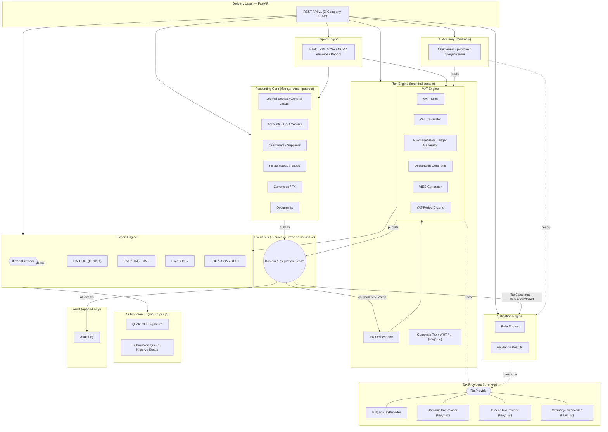

**Прочит:** Accounting Core публикува събития; Tax Engine ги консумира и извиква активния `ITaxProvider` за конкретните правила; резултатите отиват във Validation и Export; AI чете (не пише); всичко минава през Audit.

---

## 3. Domain Model

### 3.1. Bounded contexts и агрегати

Агрегатът е граница на консистентност и транзакция. Дефинираме следните агрегати:

#### Accounting Core

| Агрегат (root) | Съдържа | Инварианти |
|----------------|---------|------------|
| `JournalEntry` | `JournalLine[]` | Дебит = Кредит (в транзакционна и базова валута); не се осчетоводява по група сметка; осчетоводеният запис е неизменим (корекция само чрез сторно); всяка корекция пази `reverses_entry_id` |
| `Account` | — | Уникален код в компания; групова сметка забранява директни записи |
| `FiscalYear` | `AccountingPeriod[]` | Периодите не се препокриват; затворен период не приема записи |
| `Counterparty` | адреси, банкови данни | Уникален идентификатор (ЕИК/VAT) в компания |
| `Document` | версии, файлове, OCR резултат | Immutable съдържание; версиониране |

> **Важно:** `JournalEntry` **губи** всякакви данъчни атрибути в новата архитектура. Полетата `tax_event_date` остават (това е стопански факт — датата на данъчното събитие е част от документа), но **няма** vat_code, ставки или дневникова класификация в счетоводството.

#### Tax Engine / VAT Engine

| Агрегат (root) | Съдържа | Инварианти |
|----------------|---------|------------|
| `TaxTransaction` | `TaxComponent[]` (данъчни компоненти) | Обвързан с `source_ref` (счетоводен факт/документ); неизменим след потвърждаване; сумите на компонентите съответстват на основата×ставка ±толеранс |
| `TaxCode` (aka VatCode) | правила за третиране | Уникален код в (компания, юрисдикция); неизменяем ако е ползван |
| `TaxPeriod` | `TaxLedgerLine[]` (материализирани редове на дневниците) | Един период за юрисдикция+вид данък; след `CLOSED` е immutable; преоткриване само с audit trail |
| `TaxDeclaration` | `DeclarationCell[]` | Генерира се от затворен `TaxPeriod`; версионира се; хеш на съдържанието |
| `TaxRuleSet` | правила от провайдера | Валиден за интервал от дати (temporal) |

#### Validation Engine

| Агрегат | Съдържа | Инварианти |
|---------|---------|------------|
| `ValidationRun` | `ValidationResult[]` | Snapshot за момент; резултатите имат ниво; блокиращи грешки спират приключване |

### 3.2. Entities и Value Objects

**Value Objects (immutable, без идентичност, равенство по стойност):**

```python
# Domain/value_objects.py — илюстрация на контракти, не имплементация
@dataclass(frozen=True)
class Money:
    amount: Decimal            # 2 знака, ROUND_HALF_UP
    currency: str              # ISO-4217

@dataclass(frozen=True)
class TaxRate:
    value: Decimal             # напр. 20.00 (проценти)
    kind: RateKind             # STANDARD | REDUCED | ZERO | EXEMPT
    valid_from: date
    valid_to: date | None

@dataclass(frozen=True)
class Jurisdiction:
    code: str                  # "BG", "RO", "GR", "DE" (ISO-3166 alpha-2)

@dataclass(frozen=True)
class TaxIdentifier:            # ДДС номер / VAT number
    country: str               # "BG"
    number: str                # "123456789"
    def is_eu(self) -> bool: ...

@dataclass(frozen=True)
class DocumentReference:
    doc_type: str              # "01" фактура, "02" известие ...
    doc_number: str
    doc_date: date
    tax_event_date: date | None

@dataclass(frozen=True)
class TaxTreatment:             # резултат от класификация
    category: TaxCategory       # STANDARD_20 | REDUCED_9 | ICS | ICA | EXPORT | EXEMPT | REVERSE_CHARGE | OSS | MARGIN ...
    gives_credit: bool
    credit_coefficient: Decimal # частичен ДК (ЗДДС чл.73)
    requires_vies: bool
    requires_protocol: bool
    ledger: LedgerKind          # SALES | PURCHASE
```

**Entities (идентичност + жизнен цикъл):** `TaxTransaction`, `TaxCode`, `TaxPeriod`, `TaxDeclaration`, `TaxLedgerLine`, `ValidationResult`.

### 3.3. Ubiquitous Language (данъчен домейн)

`ДО` = данъчна основа (tax base); `ВОД` = вътреобщностна доставка (ICS, intra-community supply); `ВОП` = вътреобщностно придобиване (ICA, intra-community acquisition); `самоначисляване` = reverse charge / self-assessment; `протокол` = self-billing protocol по ЗДДС; `данъчен кредит` = input VAT credit; `справка-декларация` = VAT return; `дневник` = VAT ledger; `тристранна операция` = triangular transaction.

### 3.4. Context Map (взаимодействия между контексти)

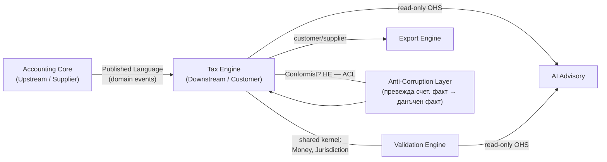

**ACL (Anti-Corruption Layer):** Tax Engine не приема суровия `JournalEntry`, а го превежда през ACL в `TaxSourceFact` — така промяна в счетоводния модел не разбива данъчния. Това е критично за независимата еволюция на двата контекста.

---

## 4. Database Schema

Конвенции (наследени от текущата система и разширени):

- **PK:** `UUID` (portable SQLite/PostgreSQL), default `uuid4`.
- **Пари:** `Numeric(18,2)`; **курсове:** `Numeric(18,6)`; **ставки:** `Numeric(5,2)`.
- **Времеви печати:** `created_at`/`updated_at` с часова зона (`TimestampMixin`).
- **Мултитенант:** всяка таблица носи `company_id` (FK `companies.id`, `ON DELETE CASCADE`, индексиран).
- **Soft delete:** `deleted_at TIMESTAMPTZ NULL` + partial index `WHERE deleted_at IS NULL` (само за entities, при които заличаването е логическо; данъчните регистри **не** се трият — само сторно).
- **Versioning:** `version INTEGER NOT NULL DEFAULT 1` (optimistic locking) за агрегатни root-ове.
- **History/Audit:** отделни `*_history` таблици (append-only) + централен `audit_logs`.
- **Юрисдикция:** новите данъчни таблици носят `jurisdiction CHAR(2)` за многодържавност.

### 4.1. Accounting Core (съществуващи — остават почти непроменени)

Таблиците `accounts`, `fiscal_years`, `accounting_periods`, `journal_entries`, `journal_lines`, `companies`, `memberships`, `counterparties` остават. **Единствената промяна:** евентуалната FK `vat_entries.journal_entry_id` се заменя от обратна, слаба препратка от Tax Engine (виж 4.2). Счетоводството не получава нови данъчни колони.

**Таблица `journal_entries` (референтна, съкратено):**

| Колона | Тип | Ключ/Индекс | Бележка |
|--------|-----|-------------|---------|
| id | UUID | PK | |
| company_id | UUID | FK companies, idx | tenant |
| period_id | UUID | FK accounting_periods, idx | |
| entry_number | INT | uq(company_id, entry_number) | при осчетоводяване |
| journal | ENUM | | GENERAL/SALES/... |
| document_type | VARCHAR(50) | | стопански факт |
| document_number | VARCHAR(50) | idx(company_id, document_number) | |
| document_date | DATE | | |
| tax_event_date | DATE NULL | | дата на данъчното събитие |
| posting_date | DATE NULL | | |
| currency | CHAR(3) | | |
| exchange_rate | NUMERIC(18,6) | | |
| status | ENUM | idx | DRAFT/POSTED/REVERSED/REVERSAL |
| reverses_entry_id | UUID NULL | FK self | сторно |
| created_by_id / posted_by_id | UUID | FK users | |

### 4.2. Tax Engine — нови таблици (table-by-table)

#### `tax_codes` (наследник на `vat_codes`, обобщен и юрисдикционен)

| Колона | Тип | Ключ/Индекс | Бележка |
|--------|-----|-------------|---------|
| id | UUID | PK | |
| company_id | UUID | FK companies, idx | tenant |
| jurisdiction | CHAR(2) | idx | "BG" |
| tax_type | ENUM | idx | VAT (бъдеще: CIT, WHT) |
| code | VARCHAR(20) | uq(company_id, jurisdiction, code) | напр. S20, PICA |
| name | VARCHAR(255) | | |
| direction | ENUM | | SALE / PURCHASE |
| category | ENUM | | STANDARD_20/REDUCED_9/ICS/ICA/EXPORT/EXEMPT/REVERSE/OSS/IOSS/MARGIN |
| rate | NUMERIC(5,2) | | |
| gives_credit | BOOL | | право на данъчен кредит |
| credit_coefficient | NUMERIC(5,4) | | частичен ДК (по подр. 1.0000) |
| requires_vies | BOOL | | |
| requires_protocol | BOOL | | самоначисляване |
| valid_from / valid_to | DATE / DATE NULL | | темпорална валидност |
| is_system | BOOL | | сеийднат от провайдера, защитен |
| is_active | BOOL | | |
| version | INT | | optimistic lock |
| deleted_at | TIMESTAMPTZ NULL | partial idx | soft delete |

#### `tax_transactions` (материализиран данъчен факт — наследник на `vat_entries`)

| Колона | Тип | Ключ/Индекс | Бележка |
|--------|-----|-------------|---------|
| id | UUID | PK | |
| company_id | UUID | FK companies, idx | tenant |
| jurisdiction | CHAR(2) | idx | |
| tax_period_id | UUID | FK tax_periods, idx | |
| tax_code_id | UUID | FK tax_codes | |
| direction | ENUM | idx | SALE/PURCHASE |
| category | ENUM | idx | денормализирано за бързи заявки |
| source_kind | ENUM | | JOURNAL_ENTRY / INVOICE / IMPORT / MANUAL |
| source_ref_id | UUID NULL | idx | слаба препратка (без твърд FK — ACL граница) |
| document_type | VARCHAR(50) | | |
| document_number | VARCHAR(50) | idx(company_id, document_number) | |
| document_date | DATE | idx | |
| tax_event_date | DATE NULL | | |
| counterparty_id | UUID NULL | FK counterparties | |
| counterparty_name | VARCHAR(255) | | snapshot |
| counterparty_vat_number | VARCHAR(20) | idx | |
| tax_base | NUMERIC(18,2) | | ДО (може отриц. при известие) |
| tax_amount | NUMERIC(18,2) | | начислен данък |
| deductible_amount | NUMERIC(18,2) | | признат ДК = tax_amount×coeff |
| currency | CHAR(3) | | |
| base_tax_base | NUMERIC(18,2) | | в базова валута |
| base_tax_amount | NUMERIC(18,2) | | |
| status | ENUM | idx | DRAFT / CONFIRMED / IN_PERIOD / DECLARED / CORRECTED |
| calculated_by | ENUM | | ENGINE / MANUAL / IMPORT |
| calc_explanation | JSONB | | защо тази категория (за AI/audit) |
| created_by_id | UUID | FK users | |
| version | INT | | |
| created_at/updated_at | TIMESTAMPTZ | | |

> **Забележка за FK:** `source_ref_id` умишлено **не** е твърд FK към `journal_entries`. Границата между контекстите изисква слаба препратка (по ID + `source_kind`), за да може счетоводството да еволюира независимо и данъчните факти да идват и от неучетоводени източници (импорт, ръчен протокол).

#### `tax_periods`

| Колона | Тип | Ключ/Индекс | Бележка |
|--------|-----|-------------|---------|
| id | UUID | PK | |
| company_id | UUID | FK, idx | |
| jurisdiction | CHAR(2) | | |
| tax_type | ENUM | | VAT |
| code | VARCHAR(10) | uq(company_id, jurisdiction, tax_type, code) | "2026-07" |
| period_start / period_end | DATE | | |
| accounting_period_id | UUID NULL | FK accounting_periods | съответствие 1:1 или N:1 |
| status | ENUM | idx | OPEN / CALCULATING / VALIDATED / CLOSED / DECLARED / SUBMITTED / REOPENED |
| closed_at | TIMESTAMPTZ NULL | | |
| closed_by_id | UUID NULL | FK users | |
| net_payable | NUMERIC(18,2) | | к.50 (снапшот при затваряне) |
| net_refundable | NUMERIC(18,2) | | к.60 |
| version | INT | | |

#### `tax_declarations`

| Колона | Тип | Ключ/Индекс | Бележка |
|--------|-----|-------------|---------|
| id | UUID | PK | |
| company_id | UUID | FK, idx | |
| tax_period_id | UUID | FK tax_periods, idx | |
| jurisdiction | CHAR(2) | | |
| declaration_type | ENUM | | VAT_RETURN / VIES / SAFT / OSS |
| revision | INT | uq(tax_period_id, declaration_type, revision) | версиониране |
| content_hash | CHAR(64) | | SHA-256 на нормализирано съдържание |
| generated_at | TIMESTAMPTZ | | |
| generated_by_id | UUID | FK users | |
| status | ENUM | | GENERATED / EXPORTED / SUBMITTED / ACCEPTED / REJECTED |

#### `tax_declaration_cells` (read-model / детайл на декларацията)

| Колона | Тип | Бележка |
|--------|-----|---------|
| id | UUID PK | |
| declaration_id | UUID FK tax_declarations, idx | |
| cell_code | VARCHAR(5) | "01","11","20"... |
| label | VARCHAR(255) | описание (от провайдера) |
| amount | NUMERIC(18,2) | |
| ordinal | INT | ред за UI |

#### `tax_ledger_lines` (CQRS read-model за дневниците — денормализиран)

| Колона | Тип | Бележка |
|--------|-----|---------|
| id | UUID PK | |
| company_id | UUID FK, idx | |
| tax_period_id | UUID FK, idx | |
| ledger_kind | ENUM idx | SALES / PURCHASE |
| seq_no | INT | пореден в дневника |
| tax_transaction_id | UUID FK | |
| column_map | JSONB | стойности по колони на официалния дневник |
| generated_at | TIMESTAMPTZ | |

#### `tax_rule_sets` (правила от провайдера, версионирани темпорално)

| Колона | Тип | Бележка |
|--------|-----|---------|
| id | UUID PK | |
| jurisdiction | CHAR(2) idx | глобални (не per-company) |
| tax_type | ENUM | |
| version_label | VARCHAR(50) | напр. "BG-2026" |
| valid_from / valid_to | DATE / DATE NULL | |
| payload | JSONB | ставки, категории, клетки, формат-спецификации |
| checksum | CHAR(64) | |

### 4.3. Validation Engine

#### `validation_runs`

| Колона | Тип | Бележка |
|--------|-----|---------|
| id | UUID PK | |
| company_id | UUID FK, idx | |
| jurisdiction | CHAR(2) | |
| scope | ENUM | TAX_PERIOD / TRANSACTION / DECLARATION |
| scope_ref_id | UUID idx | |
| triggered_by | ENUM | ON_POST / ON_CLOSE / MANUAL / SCHEDULED |
| has_blocking_errors | BOOL | |
| created_by_id | UUID FK | |
| created_at | TIMESTAMPTZ | |

#### `validation_results`

| Колона | Тип | Бележка |
|--------|-----|---------|
| id | UUID PK | |
| run_id | UUID FK validation_runs, idx | |
| rule_code | VARCHAR(50) | "MISSING_VIES", "VAT_MISMATCH"... |
| level | ENUM idx | ERROR / WARNING / INFO |
| message | VARCHAR(1000) | локализиран |
| target_kind | ENUM | TAX_TRANSACTION / PERIOD / LEDGER |
| target_ref_id | UUID NULL | |
| context | JSONB | стойности за AI обяснение |

### 4.4. Export / Submission

#### `export_artifacts`

| Колона | Тип | Бележка |
|--------|-----|---------|
| id | UUID PK | |
| company_id | UUID FK, idx | |
| declaration_id | UUID NULL FK | |
| format | ENUM | NAP_TXT / XML / SAFT_XML / EXCEL / CSV / PDF / JSON |
| filename | VARCHAR(255) | |
| content_hash | CHAR(64) | |
| storage_uri | VARCHAR(500) | обектно хранилище |
| encoding | VARCHAR(20) | напр. cp1251 |
| generated_at | TIMESTAMPTZ | |

#### `submissions` / `submission_events` (бъдеще)

| `submissions` | Тип | | `submission_events` | Тип |
|---------------|-----|---|---------------------|-----|
| id | UUID PK | | id | UUID PK |
| company_id | UUID FK | | submission_id | UUID FK |
| declaration_id | UUID FK | | event_type | ENUM (QUEUED/SIGNED/SENT/ACK/REJECTED) |
| channel | ENUM | | payload | JSONB |
| signature_ref | VARCHAR(500) | | occurred_at | TIMESTAMPTZ |
| status | ENUM | | | |

### 4.5. History таблици (пример)

За всеки версиониран агрегат — `<table>_history` (append-only): пълен ред + `history_action` (INSERT/UPDATE/DELETE), `history_at`, `history_by`. Пример `tax_codes_history`, `tax_periods_history`, `tax_transactions_history`. Записва се чрез приложна логика (не DB тригери — за portability SQLite/PG) в infrastructure слоя.

### 4.6. ER диаграма (Mermaid)

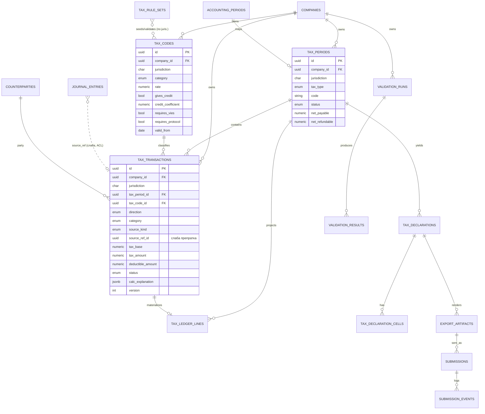

---

## 5. Class Diagram

```mermaid
classDiagram
    class ITaxProvider {
        <<interface>>
        +jurisdiction() Jurisdiction
        +supported_taxes() list~TaxType~
        +default_tax_codes() list~TaxCodeTemplate~
        +classify(fact TaxSourceFact) TaxTreatment
        +calculators() list~ITaxCalculator~
        +validators() list~IValidationRule~
        +declaration_spec(period) DeclarationSpec
        +ledger_specs() list~LedgerSpec~
        +export_providers() list~IExportProvider~
        +rounding_policy() RoundingPolicy
    }

    class BulgariaTaxProvider {
        +jurisdiction() BG
        +classify(fact) TaxTreatment
        +declaration_spec() ZddsDeclarationSpec
        +ledger_specs() [PokupkiSpec, ProdagbiSpec]
        +export_providers() [NapTxtExport, ViesExport, SaftBgExport]
    }
    class RomaniaTaxProvider
    class GreeceTaxProvider
    class GermanyTaxProvider

    class TaxProviderRegistry {
        -providers Map~Jurisdiction, ITaxProvider~
        +register(p ITaxProvider)
        +resolve(company) ITaxProvider
        +discover()
    }

    class ITaxCalculator {
        <<interface>>
        +applies_to(treatment) bool
        +calculate(fact, treatment) TaxComponent[]
    }
    class VatCalculator
    class ReverseChargeCalculator
    class MarginSchemeCalculator
    class OssCalculator

    class IValidationRule {
        <<interface>>
        +code() str
        +level() Level
        +evaluate(ctx ValidationContext) ValidationResult?
    }
    class MissingViesRule
    class VatMismatchRule
    class DuplicateDocumentRule
    class LedgerReconciliationRule

    class IExportProvider {
        <<interface>>
        +format() ExportFormat
        +content_type() str
        +encoding() str
        +render(declaration, ledgers) ExportArtifact
    }
    class NapTxtExport
    class SaftXmlExport
    class ExcelExport
    class JsonExport

    class TaxOrchestrator {
        +on_journal_entry_posted(evt)
        +recalculate(period)
    }
    class VatEngine {
        +calculate(fact) TaxTransaction
        +close_period(period) TaxPeriod
        +generate_declaration(period) TaxDeclaration
    }
    class ValidationEngine {
        +run(scope, rules) ValidationRun
    }

    class ITaxTransactionRepository {
        <<interface>>
        +add(t)
        +by_period(period_id) list
        +by_source(ref) list
    }
    class ITaxPeriodRepository
    class ITaxCodeRepository

    ITaxProvider <|.. BulgariaTaxProvider
    ITaxProvider <|.. RomaniaTaxProvider
    ITaxProvider <|.. GreeceTaxProvider
    ITaxProvider <|.. GermanyTaxProvider
    TaxProviderRegistry o-- ITaxProvider
    ITaxProvider ..> ITaxCalculator
    ITaxProvider ..> IValidationRule
    ITaxProvider ..> IExportProvider
    ITaxCalculator <|.. VatCalculator
    ITaxCalculator <|.. ReverseChargeCalculator
    ITaxCalculator <|.. MarginSchemeCalculator
    ITaxCalculator <|.. OssCalculator
    IValidationRule <|.. MissingViesRule
    IValidationRule <|.. VatMismatchRule
    IValidationRule <|.. DuplicateDocumentRule
    IValidationRule <|.. LedgerReconciliationRule
    IExportProvider <|.. NapTxtExport
    IExportProvider <|.. SaftXmlExport
    IExportProvider <|.. ExcelExport
    IExportProvider <|.. JsonExport
    TaxOrchestrator --> VatEngine
    TaxOrchestrator --> TaxProviderRegistry
    VatEngine --> ITaxTransactionRepository
    VatEngine --> ITaxPeriodRepository
    VatEngine ..> ITaxProvider
    ValidationEngine ..> IValidationRule
```

### 5.1. Ключови интерфейси (контракти, Python-style псевдокод)

```python
class ITaxProvider(Protocol):
    """Контракт за една данъчна юрисдикция. България е плъгин."""
    def jurisdiction(self) -> Jurisdiction: ...
    def supported_taxes(self) -> list[TaxType]: ...
    def default_tax_codes(self) -> list[TaxCodeTemplate]: ...
    def classify(self, fact: TaxSourceFact) -> TaxTreatment: ...
    def calculators(self) -> list["ITaxCalculator"]: ...
    def validators(self) -> list["IValidationRule"]: ...
    def declaration_spec(self, period: TaxPeriod) -> DeclarationSpec: ...
    def ledger_specs(self) -> list[LedgerSpec]: ...
    def export_providers(self) -> list["IExportProvider"]: ...
    def rounding_policy(self) -> RoundingPolicy: ...

class ITaxCalculator(Protocol):
    def applies_to(self, treatment: TaxTreatment) -> bool: ...
    def calculate(self, fact: TaxSourceFact, t: TaxTreatment) -> list[TaxComponent]: ...

class IValidationRule(Protocol):
    def code(self) -> str: ...
    def level(self) -> Level: ...              # ERROR | WARNING | INFO
    def evaluate(self, ctx: ValidationContext) -> ValidationResult | None: ...

class IExportProvider(Protocol):
    def format(self) -> ExportFormat: ...
    def content_type(self) -> str: ...
    def encoding(self) -> str: ...             # напр. "cp1251"
    def render(self, decl: TaxDeclaration, ledgers: list[Ledger]) -> ExportArtifact: ...

class ITaxTransactionRepository(Protocol):
    def add(self, t: TaxTransaction) -> None: ...
    def by_period(self, period_id: UUID) -> list[TaxTransaction]: ...
    def by_source(self, ref: SourceRef) -> list[TaxTransaction]: ...
```

---

## 6. Sequence Diagrams

### 6.1. Осчетоводяване → Tax Engine изчислява ДДС

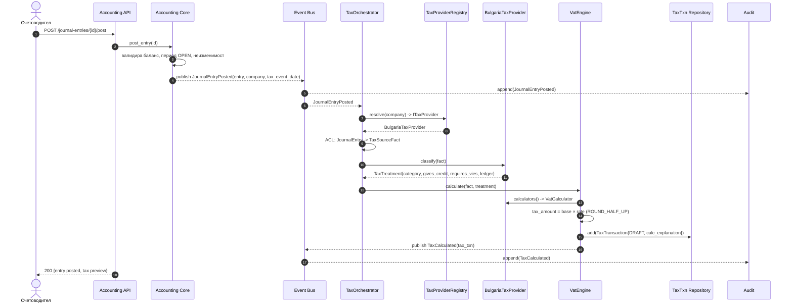

### 6.2. Месечно приключване + декларация + НАП export

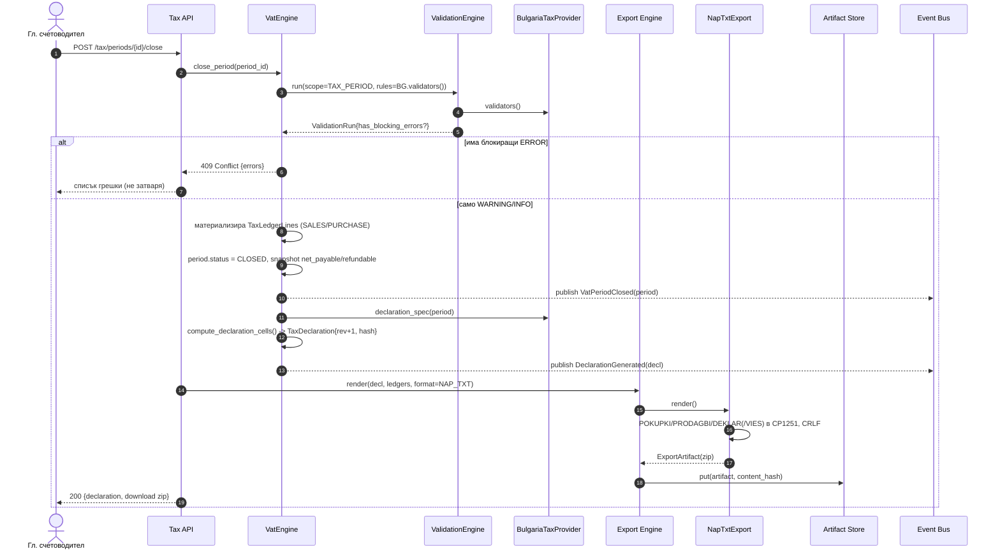

### 6.3. Валидация с грешки

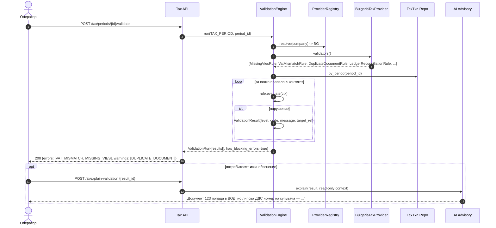

---

## 7. API Design

### 7.1. Принципи

- **Версиониране:** префикс `/api/v1` (както сега). Нови данъчни ресурси под `/api/v1/tax/...`. Breaking промени → `/api/v2`.
- **Мултитенант:** всеки заявка носи `Authorization: Bearer <JWT>` + `X-Company-Id`. Юрисдикцията се извежда от компанията (не се подава от клиента).
- **Идемпотентност:** мутиращите операции (осчетоводяване, изчисление, приключване, генериране на декларация) приемат header `Idempotency-Key`; сървърът пази резултата за ключа и връща същия отговор при повторение. Приключването е и естествено идемпотентно чрез `status`.
- **CQRS в API:** командните endpoint-и (POST) връщат ID/статус; заявките (GET) четат read-модели (регистри, декларации, оборотни).
- **Грешки:** RFC 7807 (`application/problem+json`), локализирани съобщения на български.
- **Пагинация/филтри:** `?limit&cursor`, филтри `period_id`, `direction`, `category`, `status`.

### 7.2. Endpoint каталог (Tax Engine)

| Метод | Път | Тип | Описание |
|-------|-----|-----|----------|
| GET | `/tax/providers` | Query | Изброява регистрирани провайдери и активния за компанията |
| GET | `/tax/config` | Query | Данъчен профил на компанията (юрисдикция, схеми: Cash VAT, OSS...) |
| POST | `/tax/codes/seed` | Command | Сеийдва стандартните кодове от активния провайдер |
| GET/POST | `/tax/codes` | Q/C | Списък / създаване на данъчен код |
| PATCH/DELETE | `/tax/codes/{id}` | Command | Промяна / soft delete (ако не е ползван) |
| POST | `/tax/transactions` | Command | Ръчен данъчен запис (напр. протокол) |
| GET | `/tax/transactions` | Query | Филтриран списък данъчни факти |
| POST | `/tax/transactions/recalculate` | Command | Преизчисляване за период/източник |
| GET/POST | `/tax/periods` | Q/C | Данъчни периоди |
| POST | `/tax/periods/{id}/validate` | Command | Стартира ValidationRun |
| POST | `/tax/periods/{id}/close` | Command | Приключване (idempotent, блокира при ERROR) |
| POST | `/tax/periods/{id}/reopen` | Command | Преоткриване (audit trail, роля-ограничено) |
| GET | `/tax/periods/{id}/return` | Query | Обобщение ДДС за внасяне/възстановяване |
| GET | `/tax/periods/{id}/ledgers/sales` | Query | Дневник продажби (read-model) |
| GET | `/tax/periods/{id}/ledgers/purchases` | Query | Дневник покупки |
| POST | `/tax/periods/{id}/declaration` | Command | Генерира декларация (rev+1) |
| GET | `/tax/declarations/{id}` | Query | Клетки + метаданни |
| GET | `/tax/declarations/{id}/export?format=nap_txt\|xml\|saft\|excel\|csv\|pdf\|json` | Query | Изтегляне на артефакт |
| GET | `/tax/periods/{id}/vies` | Query | VIES декларация |
| GET/POST | `/tax/validation-runs` | Q/C | История и стартиране на валидации |
| GET | `/tax/submissions` (бъдеще) | Query | История на подаванията |

### 7.3. Пример — приключване (идемпотентно)

```
POST /api/v1/tax/periods/{id}/close
Authorization: Bearer <JWT>
X-Company-Id: <uuid>
Idempotency-Key: 5f...c2

200 OK
{
  "period_id": "...", "status": "CLOSED",
  "net_payable": "1234.56", "net_refundable": "0.00",
  "validation": { "blocking": false, "warnings": 2 },
  "declaration": { "id": "...", "revision": 1 }
}

409 Conflict  (при блокиращи грешки)
{
  "type": "/errors/tax-period-blocking-validation",
  "title": "Периодът не може да бъде приключен",
  "errors": [ {"code":"MISSING_VIES","target":"..."} ]
}
```

---

## 8. Folder Structure

```
apps/api/app/
├── core/                      # config, database, security (както сега)
├── db/                        # base, mixins, migrations (alembic)
├── api/
│   ├── deps.py                # CurrentUser, CompanyContext, + resolve_tax_provider
│   └── v1/                    # агрегиране на рутери
├── shared/                    # cross-context value objects
│   ├── money.py               # Money, Currency
│   ├── events.py              # EventBus (Protocol), in-process impl, DomainEvent base
│   └── jurisdiction.py        # Jurisdiction, TaxType, ISO helpers
├── modules/
│   ├── identity/              # (както сега)
│   ├── companies/             # + tax_profile (юрисдикция, схеми)
│   ├── accounting/            # ЯДРО — БЕЗ данъчни правила
│   │   ├── domain/            #   aggregates, events (JournalEntryPosted)
│   │   ├── application/
│   │   ├── infrastructure/
│   │   ├── models.py · service.py · router.py · schemas.py
│   ├── counterparties/ · documents/ · reports/ · banking/ · invoicing/
│   │   · purchases/ · payments/ · assets/ · audit/
│   │
│   ├── tax/                   # >>> НОВ bounded context: Tax Engine <<<
│   │   ├── domain/
│   │   │   ├── aggregates.py          # TaxTransaction, TaxPeriod, TaxDeclaration
│   │   │   ├── value_objects.py       # TaxRate, TaxTreatment, TaxCategory, DocumentReference
│   │   │   ├── events.py              # TaxCalculated, VatPeriodClosed, DeclarationGenerated
│   │   │   ├── contracts.py           # ITaxProvider, ITaxCalculator, IExportProvider ...
│   │   │   └── acl.py                 # TaxSourceFact + превод от счетоводен факт
│   │   ├── application/
│   │   │   ├── commands/              # CalculateTax, ClosePeriod, GenerateDeclaration
│   │   │   ├── queries/               # GetLedger, GetDeclaration, GetReturn
│   │   │   ├── orchestrator.py        # TaxOrchestrator (event handlers)
│   │   │   └── ports.py               # repository интерфейси
│   │   ├── infrastructure/
│   │   │   ├── models.py              # SQLAlchemy: tax_codes, tax_transactions, ...
│   │   │   ├── repositories.py        # имплементации на портовете
│   │   │   └── registry.py            # TaxProviderRegistry + discovery
│   │   ├── engines/
│   │   │   ├── vat/                   # VAT Engine
│   │   │   │   ├── calculator.py · closing.py · declaration.py
│   │   │   │   ├── ledgers.py · vies.py
│   │   │   └── __init__.py            # (бъдеще: corporate_tax/, wht/)
│   │   ├── validation/               # Validation Engine
│   │   │   ├── engine.py · context.py
│   │   │   └── rules/                # generic правила (юрисдикция-агностични)
│   │   ├── export/                   # Export Engine
│   │   │   ├── contracts.py          # IExportProvider
│   │   │   ├── excel.py · csv.py · json.py · pdf.py · xml_base.py
│   │   └── router.py                 # /tax/... endpoints
│   │
│   └── providers/            # >>> Tax Providers (плъгини) <<<
│       ├── __init__.py                # автодискавъри и регистрация
│       ├── base.py                    # BaseTaxProvider (общи helpers)
│       ├── bulgaria/
│       │   ├── provider.py            # BulgariaTaxProvider(ITaxProvider)
│       │   ├── codes.py               # STANDARD_BG_TAX_CODES (мигрирани)
│       │   ├── classification.py      # classify_sale/purchase (от nap_export.py)
│       │   ├── declaration_spec.py    # клетки 01..60 по ЗДДС
│       │   ├── ledger_spec.py         # POKUPKI / PRODAGBI структура
│       │   ├── rules.py               # BG-специфични IValidationRule
│       │   └── export/
│       │       ├── nap_txt.py         # CP1251 TXT (от nap_export.py)
│       │       ├── vies_txt.py
│       │       └── saft_bg.py         # бъдещ SAF-T BG
│       ├── romania/                   # (бъдеще) provider.py, ...
│       ├── greece/                    # (бъдеще)
│       └── germany/                   # (бъдеще)
│
├── import_engine/             # Import Engine (bank/xml/csv/ocr/einvoice/peppol)
├── submission/                # Submission Engine (бъдеще)
└── modules/ai/                # AI Advisory (read-only консуматор)
```

**Ключова граница:** `modules/tax/**` **не импортва** нищо от `modules/providers/bulgaria/**` директно — само през `TaxProviderRegistry` и контрактите. Обратното е позволено (провайдерът реализира контрактите на ядрото).

---

## 9. Event Flow

### 9.1. Каталог на събитията

| Събитие | Тип | Публикува | Консумира | Payload (ключово) |
|---------|-----|-----------|-----------|-------------------|
| `JournalEntryPosted` | domain | Accounting Core | TaxOrchestrator, Audit | entry_id, company_id, tax_event_date, lines snapshot |
| `JournalEntryReversed` | domain | Accounting Core | TaxOrchestrator (сторнира TaxTransaction), Audit | entry_id, reverses_id |
| `DocumentImported` | integration | Import Engine | TaxOrchestrator (опц.), Accounting | source, extracted fields |
| `TaxCalculated` | domain | VAT Engine | Validation (инкрементално), AI, Audit | tax_txn_id, category, amounts |
| `TaxPeriodValidated` | domain | Validation Engine | UI/Notifications, Audit | run_id, has_blocking_errors |
| `VatPeriodClosed` | domain | VAT Engine | Declaration flow, Reports, Audit | period_id, net_payable |
| `DeclarationGenerated` | domain | VAT Engine | Export Engine, Audit | declaration_id, revision, hash |
| `ExportRendered` | domain | Export Engine | Submission (бъдеще), Audit | artifact_id, format |
| `DeclarationSubmitted` | integration | Submission (бъдеще) | Audit, Notifications | submission_id, status |

### 9.2. Event Bus (архитектура)

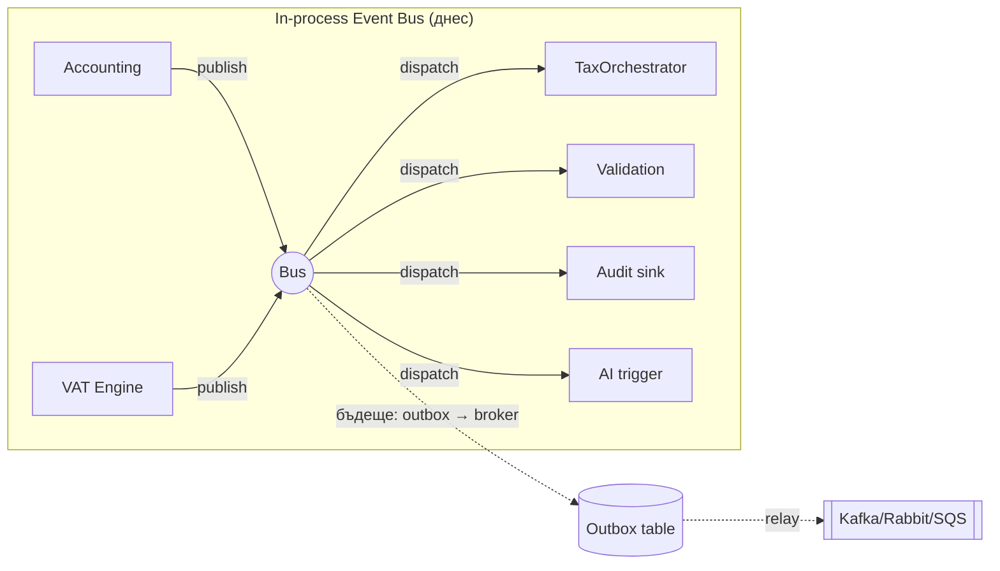

- **Днес:** синхронен in-process dispatcher, транзакционно съгласуван с командата (публикуване след commit, чрез **transactional outbox** за надеждност).
- **Готовност за мащаб:** `EventBus` е `Protocol`; при нужда се сменя с брокер без промяна на публикуващите/консумиращите. Handler-ите са идемпотентни (по event id).
- **Ред и повторение:** consumer-ите съхраняват `processed_event_id`; повторно събитие се игнорира.

### 9.3. Защо event-driven, а не директно извикване

Ако Accounting извикваше VAT директно, счетоводството щеше да зависи от данъчния модул — точно това, което избягваме. Събитието е публикуван факт („статия N е осчетоводена"); който се интересува, се абонира. Счетоводството може да работи и без нито един данъчен консуматор.

---

## 10. Validation Flow

### 10.1. Модел Rule / Result

```python
class Level(str, Enum):
    ERROR = "ERROR"      # блокира приключване/подаване
    WARNING = "WARNING"  # изисква внимание, не блокира
    INFO = "INFO"        # информативно

@dataclass
class ValidationResult:
    rule_code: str
    level: Level
    message: str                 # локализирано (BG)
    target_kind: str             # TAX_TRANSACTION | PERIOD | LEDGER
    target_ref_id: UUID | None
    context: dict                # за AI обяснение и UI навигация

class ValidationContext:
    company: Company
    provider: ITaxProvider
    period: TaxPeriod | None
    transactions: list[TaxTransaction]
    ledgers: LedgerSnapshot | None
```

### 10.2. Откъде идват правилата

Правилата са **два слоя**:

1. **Generic (юрисдикция-агностични)** — в `tax/validation/rules/`: баланс, липсващ контрагент, невалидна дата извън период, дублиран документ, несъответствие сума×ставка.
2. **Национални** — връщат се от `ITaxProvider.validators()`. `BulgariaTaxProvider` добавя: задължителен VIES ДДС номер за ВОД/ВОП, изискуем протокол при самоначисляване, съответствие дневник продажби ↔ клетки на декларацията, специфични НАП формат-проверки.

`ValidationEngine.run()` събира generic + provider правилата и ги изпълнява над контекста.

### 10.3. Каталог правила (примерен, разширяем)

| Код | Ниво | Слой | Проверка |
|-----|------|------|----------|
| `MISSING_VAT_NUMBER` | ERROR | provider | Липсва ДДС номер, където е задължителен |
| `INVALID_RATE` | ERROR | generic | Ставка не е сред разрешените за категорията/датата |
| `MISSING_DOCUMENT` | ERROR | generic | Данъчен факт без документ |
| `INVALID_DATE` | ERROR | generic | Дата на данъчно събитие извън периода |
| `DUPLICATE_DOCUMENT` | WARNING | generic | Един документ, повече записи |
| `WRONG_TRANSACTION_TYPE` | ERROR | provider | Категория несъвместима с посоката/контрагента |
| `JE_VAT_MISMATCH` | ERROR | provider | Journal Entry сума ≠ ДО+ДДС на данъчния факт |
| `LEDGER_MISMATCH` | ERROR | provider | Сума в дневника ≠ сума в декларацията |
| `MISSING_COUNTERPARTY` | ERROR | generic | Липсва контрагент |
| `INVALID_EU_VAT_VIES` | ERROR | provider | ДДС номер не преминава VIES структурна/онлайн проверка |
| `VAT_MISMATCH` | ERROR | generic | ДДС ≠ основа×ставка (±0.02 толеранс) |
| `MISSING_PROTOCOL` | ERROR | provider | Самоначисляване без протокол |

### 10.4. Кога се изпълнява

- **On post** (`TaxCalculated`) — инкрементална валидация на конкретния запис (бърза обратна връзка).
- **On close** — пълна валидация на периода; блокиращите ERROR спират приключването.
- **Manual / Scheduled** — по заявка или нощен batch за отворени периоди.

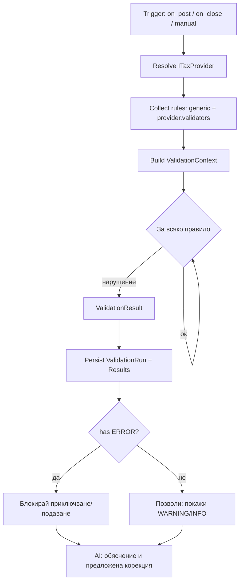

---

## 11. Export Flow

### 11.1. Принцип: Export Engine е чиста трансформация

Export Engine **не смята данъци**. Той приема готова `TaxDeclaration` + `Ledger` read-модели и ги превежда в конкретен формат. Форматите са плъгини `IExportProvider`; юрисдикция-специфичните (НАП TXT/CP1251, SAF-T BG) идват от `ITaxProvider.export_providers()`, докато generic-ите (Excel, CSV, JSON, PDF, REST) са в ядрото на Export Engine.

### 11.2. Формати

| Формат | Провайдер | Кодиране | Юрисдикция |
|--------|-----------|----------|------------|
| НАП TXT (POKUPKI/PRODAGBI/DEKLAR/VIES) | `NapTxtExport` | CP1251, CRLF | BG (от `providers/bulgaria`) |
| SAF-T XML | `SaftXmlExport` / `SaftBgExport` | UTF-8 | generic схема + национален профил |
| XML (generic) | `XmlExport` | UTF-8 | ядро |
| Excel (.xlsx) | `ExcelExport` | — | ядро |
| CSV | `CsvExport` | UTF-8/по избор | ядро |
| PDF | `PdfExport` | — | ядро (визуализация на декларация/дневник) |
| JSON / REST | `JsonExport` | UTF-8 | ядро (интеграции) |

### 11.3. Поток

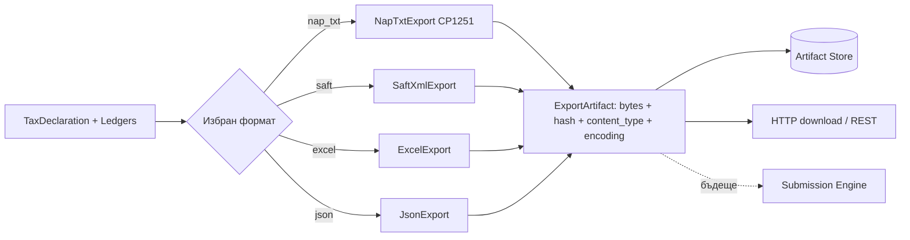

### 11.4. Golden-file гаранция

Всеки формат има референтни (golden) файлове. Промяна в изхода без съответна промяна на golden файл = провален тест. Това защитава байтова съвместимост с НАП (дължини на полета, разделители, кодиране).

---

## 12. Future Extensions

- **Нови Tax Providers:** Romania, Greece, Germany, и т.н. — всеки нов пазар = нов плъгин, без промяна в ядрото. Multi-jurisdiction компании (клон в друга държава) получават повече от един активен провайдер.
- **Нови видове данъци** в Tax Engine: корпоративен данък (CIT), данък при източника (WHT), акцизи, местни данъци — като нови engines под `tax/engines/`, използващи същия `ITaxProvider` контракт (`supported_taxes()`).
- **OSS / IOSS** трансгранична търговия B2C — отделни калкулатори и декларации през провайдера.
- **Margin Scheme** (туризъм, стоки втора употреба) — `MarginSchemeCalculator`.
- **e-Invoicing / Peppol / ViDA** (VAT in the Digital Age) — реалновременно отчитане; Import/Export Engine готови за Peppol BIS.
- **SAF-T задължителност** — вече проектиран като Export Provider (раздел 18).
- **Submission Engine** реално подаване с КЕП към НАП/национални портали.
- **Real-time / continuous validation** и AI-базирано предсказване на данъчен резултат преди край на периода.
- **Rules-as-data / DSL** — правилата и клетките на декларациите като версионирани данни (`tax_rule_sets`), редактируеми от данъчен консултант без деплой.

---

## 13. Security

### 13.1. Мултитенант изолация

- Всяка данъчна таблица носи `company_id`; всеки repository метод е скоупнат по компания (наследено от текущия `CompanyContext` + `X-Company-Id`).
- **Defense in depth:** освен приложен филтър, при PostgreSQL се въвежда **Row-Level Security (RLS)** — политика `company_id = current_setting('app.company_id')`, зададен per-транзакция. Така дори пропуснат `WHERE` не изтича данни между тенанти.
- Юрисдикцията се извежда от компанията, никога от клиентски вход — предотвратява подаване на грешен провайдер.

### 13.2. RBAC (по съществуващите роли)

| Действие | Разрешени роли |
|----------|----------------|
| Създаване/промяна на данъчни кодове | CHIEF_ACCOUNTANT, TAX_CONSULTANT, SYS_ADMIN |
| Ръчен данъчен запис / протокол | ACCOUNTANT+ |
| Валидиране на период | ACCOUNTANT+ |
| Приключване на период | CHIEF_ACCOUNTANT, CFO |
| Преоткриване (reopen) | CHIEF_ACCOUNTANT + SECURITY_ADMIN (four-eyes) |
| Генериране/износ на декларация | CHIEF_ACCOUNTANT, TAX_CONSULTANT |
| Подаване (бъдеще) | CFO / упълномощен (maker-checker) |
| Четене (регистри/декларации) | AUDITOR, READ_ONLY (read-only) |

**Maker-checker** за критични данъчни действия (приключване, подаване) — както в текущия payments модул.

### 13.3. Audit trail

- Централен append-only `audit_logs` (както сега, middleware по всяко мутиращо действие) **плюс** domain-event журнал: всяко данъчно събитие (`TaxCalculated`, `VatPeriodClosed`, `DeclarationGenerated`) се записва неизменимо.
- Данъчните факти не се трият — корекция само чрез сторно/нов запис със `reverses`.
- `content_hash` на всяка декларация и export артефакт — доказуема цялост.

### 13.4. Подписване (бъдеще)

Квалифициран електронен подпис (КЕП) в Submission Engine; подписът се пази отделно (`signature_ref`), заедно с подписаното съдържание и timestamp. Подписването е Prohibited за автоматизация без изрично човешко потвърждение — системата подготвя, човек подписва.

### 13.5. GDPR

- Контрагентите/лицата — данни минимизирани; snapshot полета (`counterparty_name`) за одит, но с връзка към master записа за право на изтриване/анонимизация.
- Право на изтриване се съгласува с данъчните срокове за съхранение (законово задължение надделява — данъчните регистри се пазят нормативния срок; анонимизация след изтичането му).
- Данъчните файлове (НАП) могат да съдържат лични данни → криптирани at-rest.

### 13.6. Криптиране

- **In transit:** TLS.
- **At rest:** криптиране на export артефактите и документите (обектно хранилище с KMS-управлявани ключове); чувствителни колони (ДДС номера при нужда) — column-level криптиране/пойнт.
- Секрети (ANTHROPIC_API_KEY, КЕП) — извън кода, чрез secrets manager (наследено: LLM клиентът никога не логва ключа).

---

## 14. Performance

### 14.1. Индекси (критични)

- `tax_transactions(company_id, tax_period_id)` — основна заявка за период.
- `tax_transactions(company_id, direction, category)` — агрегиране за декларация.
- `tax_transactions(company_id, document_number)` — детекция на дубликати.
- `tax_transactions(company_id, counterparty_vat_number)` — VIES групиране.
- `tax_ledger_lines(tax_period_id, ledger_kind, seq_no)` — четене на дневник.
- Partial indexes `WHERE deleted_at IS NULL` и `WHERE status = 'OPEN'`.

### 14.2. Read-модели (CQRS)

Дневниците и декларациите се **материализират** при приключване (`tax_ledger_lines`, `tax_declaration_cells`), а не се смятат наlive при всяко четене. UI чете директно от проекциите — константна сложност спрямо обема, устойчиво възпроизвеждане на подадения файл.

### 14.3. Кеш

- Провайдери и rule sets се кешират в паметта (immutable за версия/дата); инвалидиране при нова версия на `tax_rule_sets`.
- Резултати от VIES онлайн проверки — кеш с TTL (VIES е бавен/нестабилен), fallback към структурна проверка.

### 14.4. Batch приключвания

- Приключване на много компании (счетоводна къща) — batch job през опашка, с progress и частична толерантност (една компания с ERROR не спира останалите).
- Масовите изчисления се групират (bulk insert на `tax_transactions`, `executemany`).

### 14.5. Обеми (проектни допускания)

| Метрика | Порядък | Стратегия |
|---------|---------|-----------|
| Данъчни факти / компания / месец | 10² – 10⁵ | индекси + проекции |
| Компании (SaaS, счет. къща) | 10³ – 10⁴ | tenant по `company_id`, RLS |
| Записи в дневник за export | до 10⁵ | стриймов рендер, без държане в памет наведнъж |
| Периоди в архив | 10² на компания | партициониране по година (бъдеще) |

Партициониране на `tax_transactions` по (година) при PostgreSQL, когато обемите го налагат.

---

## 15. Test Strategy

### 15.1. Пирамида

| Ниво | Обхват | Пример |
|------|--------|--------|
| **Unit** | Value objects, калкулатори, класификация | `VatCalculator`: 20% от 100.00 = 20.00; ROUND_HALF_UP на 0.125 |
| **Domain** | Инварианти на агрегати | Затворен период не приема запис; сторно не трие |
| **Contract** | Всеки `ITaxProvider` изпълнява общ contract-test пакет | Всеки провайдер връща валиден `declaration_spec`, покрива всички категории |
| **Golden-file** | Байтова съвместимост на НАП/SAF-T формати | POKUPKI/PRODAGBI/DEKLAR/VIES срещу референтни файлове (CP1251, дължини) |
| **Integration** | Event flow, репозитории, DB | JournalEntryPosted → TaxTransaction в DB |
| **E2E / API** | Пълен поток през FastAPI | Осчетоводяване → приключване → export zip |
| **Property-based** | Инварианти върху случайни данни | Σ дневник = Σ клетки на декларация; net = начислен − кредит |

### 15.2. Contract-тестове за провайдери (ключово за плъгин архитектурата)

Дефинира се абстрактен тест-пакет `TaxProviderContractTests`, който **всеки** провайдер трябва да мине: юрисдикцията е валиден ISO код; всяка категория има поне един код; всяко правило има уникален код и ниво; декларацията балансира (к.20 − к.40 = к.50/к.60); export провайдерите връщат детерминиран изход. Нов провайдер = наследяване на пакета + фикстури.

### 15.3. Golden-file за НАП формати

Референтни ZIP/TXT за набор сценарии (само 20%, смес 20/9, ВОД+VIES, ВОП самоначисляване, кредитно известие, без ДК). Всяка промяна в рендера изисква ревю на diff-а срещу golden. Проверяват се: кодиране CP1251, CRLF, разделители, дължини/клипване на полета, форматиране на суми (`1234.56`) и дати (`dd/mm/yyyy`).

### 15.4. Регресия и данъчни промени

Промяна на ставка/клетка за нова година → нов `tax_rule_set` с `valid_from`; тестове за граничните дати (транзакция на 31.12 vs 01.01 ползва правилния rule set).

---

## 16. AI Integration

### 16.1. Принцип: „AI само предлага" (read-only advisory)

AI модулът е **консуматор**, не участник в изчислението. Данъчното задължение се определя единствено от Tax Engine + активния провайдер (детерминирано, одитируемо). AI:

- **обяснява** защо сделка попада в конкретна ДДС категория (чете `calc_explanation` от `tax_transactions` и `TaxTreatment`);
- **открива счетоводни/данъчни грешки** (чете `ValidationResult`-ите и предлага корекция на разбираем език);
- **предупреждава за липсващи документи** (крос-чек данъчен факт ↔ documents);
- **открива необичайни операции / данъчни рискове** (аномалии спрямо исторически профил на компанията);
- **генерира обяснение** за одитор/собственик на достъпен език.

Всяко AI предложение е **suggestion**, което човек одобрява; нищо не се осчетоводява/подава автоматично. Съответства на съществуващата `LLMClient` абстракция (`AnthropicLLMClient` `claude-opus-5` / `StubLLMClient`).

### 16.2. Как AI ползва данните

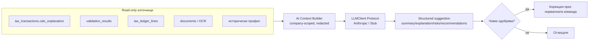

- Контекстът е **company-scoped** и редактиран (без излишни лични данни); структуриран изход чрез forced tool-call (както сегашните `EXTRACTION_SCHEMA`/`ANALYSIS_SCHEMA`).
- AI **никога** не пише в данъчните таблици директно; прилагането на предложение минава през обичайната команда (със същия RBAC и audit).
- Обясненията се логват (какво е предложил моделът, какво е решил човекът) — за одит и подобрение.

### 16.3. Use-case пример

Валидацията връща `MISSING_VIES` за документ 123. AI обяснява: документът е класифициран като ВОД (0%), защото контрагентът е в ЕС и кодът изисква VIES; липсва ДДС номер на купувача; предложение: „добавете валиден ЕС ДДС номер или прекласифицирайте като облагаема доставка 20%". Човекът решава.

---

## 17. Bulgarian Localization (BulgariaTaxProvider)

Цялата българска специфика е **данни и правила в `providers/bulgaria`**, зад `ITaxProvider`. Ядрото не знае за ЗДДС.

### 17.1. Ставки и категории

| Категория (`TaxCategory`) | Ставка | Дневник | ДК | Бележка |
|---------------------------|--------|---------|----|---------|
| STANDARD_20 | 20% | продажби/покупки | зависи | стандартна |
| REDUCED_9 | 9% | продажби/покупки | зависи | намалена (напр. настаняване) |
| ZERO_EXPORT | 0% | продажби | — | износ извън ЕС (гл. трета) |
| ICS (ВОД) | 0% | продажби | — | изисква VIES ДДС номер |
| ICA (ВОП) | 20% самоначисл. | покупки | да | протокол + VIES |
| REVERSE_CHARGE | 20% самоначисл. | покупки | да | чл.82 / чл.163а |
| EXEMPT | 0% | продажби | — | освободени доставки (гл. четвърта) |
| NO_CREDIT | 20% | покупки | не | без право на данъчен кредит |
| PARTIAL_CREDIT | 20% | покупки | частичен | коефициент по чл.73 |

### 17.2. Сценарии по ЗДДС (правила в провайдера)

- **Reverse charge / самоначисляване (чл.82, чл.163а):** покупка от нерегистриран/ЕС доставчик → протокол; начисленият ДДС е едновременно в „начислен" (к.21) и „данъчен кредит" (к.41) при пълно право.
- **ВОД (чл.7):** 0% при валиден ЕС ДДС номер (VIES) + доказателства за транспорт; влиза в к.15 и VIES декларация.
- **ВОП (чл.13):** самоначисляване 20%; к.12/к.21 (начислен) и к.31/к.41 (кредит).
- **ЕС / извън ЕС:** различно третиране (ВОД/ВОП vs износ/внос); услуги по чл.21 (място на изпълнение).
- **Cash VAT (касова отчетност, гл. 17а):** данъчното събитие за ДДС настъпва при плащане, не при фактуриране — отделен режим; `TaxTransaction` се обвързва с плащане.
- **Освободени доставки (гл. четвърта):** к.18/к.19; без ДК за свързаните покупки.
- **Без право на данъчен кредит (чл.70):** леки автомобили, представителни разходи → к.30.
- **Протоколи по ЗДДС:** отделен документ-тип; `requires_protocol=True`; валидатор `MISSING_PROTOCOL`.
- **Кредитни/дебитни известия (чл.115):** отрицателна/корекционна ДО; свързани към първичния документ; коректно в дневника и декларацията.
- **Корекции на ДК (чл.79):** промяна в използването на актив → корекционен запис.
- **Частичен данъчен кредит (чл.73):** коефициент; к.33/к.42; годишно преизчисление.

### 17.3. НАП формати и клетки

Провайдерът носи: клетки 01–60 на справка-декларацията (както в текущия `DeclarationCells`), структурата на POKUPKI/PRODAGBI (колони, дължини), DEKLAR, VIES; кодиране CP1251, CRLF. Класификацията `classify_sale`/`classify_purchase` се мигрира от `nap_export.py` в `providers/bulgaria/classification.py`, задвижвана от атрибутите на кода (ставка, VIES, протокол, право на кредит) — така потребителски кодове също се разпределят коректно.

### 17.4. Стандартни кодове (сеийднати от провайдера)

Мигрират се текущите `STANDARD_BG_VAT_CODES` (S20, S09, SICS, SEXP, SEXM, P20, P09, PNOCR, PICA, PREV) в `providers/bulgaria/codes.py`, обогатени с `category`, `credit_coefficient`, `valid_from`. Маркирани `is_system=True` (защитени от изтриване).

---

## 18. SAF-T Readiness

SAF-T (Standard Audit File for Tax, OECD) предстои да стане задължителен в България (поетапно). Проектираме го **отсега** като отделен `IExportProvider`, без да е активен:

- **`SaftXmlExport` (generic)** в Export Engine — общата OECD SAF-T 2.0 схема (GeneralLedgerEntries, MasterFiles, SourceDocuments).
- **`SaftBgExport`** в `providers/bulgaria/export/saft_bg.py` — националният профил (български номенклатури, специфични полета, версия на схемата за годината).
- Данните за SAF-T идват от **Accounting Core** (ГК, сметки, контрагенти) **и** Tax Engine (данъчни факти) — Export Engine ги композира; **не** дублира логика.
- Golden-file тестове срещу примерна НАП SAF-T схема; валидиране срещу XSD.
- Тъй като SAF-T е широкообхватен (не само ДДС), той черпи от няколко контекста през read-модели — затова Export Engine е позициониран да чете от проекции, а не да смята.

Резултат: когато SAF-T стане задължителен, се активира съществуващ провайдер — без архитектурна промяна.

---

## 19. National Tax Engine Abstraction

### 19.1. Контракт `ITaxProvider` (детайлно)

```python
class ITaxProvider(Protocol):
    # --- идентичност и конфигурация ---
    def jurisdiction(self) -> Jurisdiction: ...          # "BG"
    def display_name(self) -> str: ...                   # "България (ЗДДС)"
    def supported_taxes(self) -> list[TaxType]: ...       # [VAT] (бъдеще: CIT, WHT)
    def schemes(self) -> list[TaxScheme]: ...             # CASH_VAT, OSS, IOSS, MARGIN...
    def rule_set_version(self, on: date) -> str: ...      # темпорална версия

    # --- кодове и класификация ---
    def default_tax_codes(self) -> list[TaxCodeTemplate]: ...
    def classify(self, fact: TaxSourceFact) -> TaxTreatment: ...

    # --- изчисление ---
    def calculators(self) -> list[ITaxCalculator]: ...
    def rounding_policy(self) -> RoundingPolicy: ...      # ROUND_HALF_UP, толеранс 0.02

    # --- валидация ---
    def validators(self) -> list[IValidationRule]: ...

    # --- декларации и регистри ---
    def declaration_spec(self, period: TaxPeriod) -> DeclarationSpec: ...  # клетки, формули
    def ledger_specs(self) -> list[LedgerSpec]: ...                        # колони на дневниците
    def vies_spec(self) -> ViesSpec | None: ...

    # --- износ / подаване ---
    def export_providers(self) -> list[IExportProvider]: ...
    def submission_channels(self) -> list[SubmissionChannel]: ...  # бъдеще
```

### 19.2. Регистрация и discovery

```python
class TaxProviderRegistry:
    def register(self, provider: ITaxProvider) -> None: ...
    def resolve(self, company: Company) -> ITaxProvider:
        # по company.tax_profile.jurisdiction (напр. "BG")
        ...
    def resolve_all(self, company: Company) -> list[ITaxProvider]:
        # multi-jurisdiction (клон в чужбина)
        ...
    def discover(self) -> None:
        # автодискавъри: entry points / модул сканиране на providers/*
        ...
```

- **Discovery:** при стартиране регистърът сканира `app/modules/providers/*` (или Python entry points), инстанцира провайдерите и ги регистрира по юрисдикция. Нов провайдер = нов пакет; **нула промени в ядрото**.
- **Конфигурация по компания:** `companies.tax_profile` (нова структура/таблица) съдържа `jurisdiction`, активни `schemes` (Cash VAT, OSS...), периодичност на подаване. `resolve(company)` връща правилния провайдер.
- **Multi-jurisdiction:** компания с дейност в няколко държави → `resolve_all`; всеки период/декларация носи `jurisdiction`.
- **Версиониране на правила:** `rule_set_version(on_date)` избира правилния набор (ставки/клетки) за датата на данъчното събитие — критично при законодателни промени в началото на година.

### 19.3. Как ядрото остава чисто

Tax Engine оркестрира абстрактно: „resolve провайдер → classify → calculate → validate → declaration_spec → export". Нито един `if jurisdiction == "BG"` в ядрото. България, Румъния, Гърция, Германия са симетрични плъгини. Това превръща продукта в международна платформа.

---

## 20. Development Roadmap

Еволюционен път — **без пренаписване на счетоводното ядро**. Всяка фаза е доставима и обратно съвместима.


| Фаза | Цел | Ключови задачи | Приоритет |
|------|-----|----------------|-----------|
| **0. Основи** | Инфраструктура за разделянето | `shared/events.py` (in-process bus + outbox), `Jurisdiction`/`Money` VOs, `TaxProviderRegistry` скелет, `deps.resolve_tax_provider` | P0 |
| **1. Extract Tax Engine** | Изнасяне на `vat` → `tax` bounded context | Нови таблици (`tax_codes`, `tax_transactions`, `tax_periods`); ACL `TaxSourceFact`; миграция на данни от `vat_entries`→`tax_transactions`; Accounting публикува `JournalEntryPosted` | P0 |
| **2. VAT Engine + BulgariaTaxProvider** | Изчислението зад провайдер | Мигрирай `classify_*`, кодове, клетки в `providers/bulgaria`; `VatCalculator`; `TaxOrchestrator` слуша събития; провайдерът е първият плъгин | P0 |
| **3. Validation Engine** | Правила като контракти от провайдера | `IValidationRule`, generic + BG правила; `ValidationRun`/`Result`; блокиране при ERROR; on-post/on-close | P1 |
| **4. Export + SAF-T readiness** | Формати като плъгини | `IExportProvider`; `NapTxtExport` (мигриран, golden-file); Excel/CSV/JSON/PDF; `SaftBgExport` скелет | P1 |
| **5. AI Advisory** | Read-only обяснения/рискове | AI Context Builder над Tax/Validation; обяснения, аномалии, липсващи документи; „AI само предлага" | P2 |
| **6. Submission Engine** | Подготовка за реално подаване | Подписване (КЕП), опашка, история, статуси, acknowledgement store; maker-checker | P2 |
| **7. Втори Tax Provider** | Доказване на международността | `RomaniaTaxProvider` (или GR/DE) през същия contract-test пакет; multi-jurisdiction | P3 |

### 20.1. Стратегия за миграция от текущия `vat` модул

1. **Strangler Fig:** новият `tax` контекст работи паралелно; `vat` endpoint-ите се пренасочват към `tax` зад същите URL-и (или се задава deprecation).
2. **Backfill:** еднократна миграция `vat_entries` → `tax_transactions` (map: `vat_code`→`tax_code`, `direction`, изчислен `category` чрез `classify_*`).
3. **Двойно изпълнение (shadow):** за няколко периода се смятат и старият, и новият път; сравняват се декларации/НАП файлове (golden diff) до пълно съвпадение.
4. **Отрязване:** премахване на стария `vat` модул след потвърдено съвпадение и приемане от данъчен консултант.

Счетоводното ядро в целия път получава **само едно** ново задължение — да публикува `JournalEntryPosted`; всичко останало е адитивно.

---

## Приложение A — UI екрани

Само изброяване (без дизайн):

1. **VAT Dashboard** — обобщение за периода: за внасяне/възстановяване, статус, брой грешки/предупреждения.
2. **VAT Codes** — списък и редакция на данъчни кодове (системни защитени).
3. **VAT Validation** — резултати от валидацията с навигация към записа.
4. **VAT Declaration** — клетки 01–60, преглед преди износ.
5. **Purchase Ledger** — дневник покупки (read-model).
6. **Sales Ledger** — дневник продажби.
7. **VIES** — VIES декларация по контрагенти.
8. **Submission History** — история на подаванията и статуси (бъдеще).
9. **Tax Rules** — преглед/конфигуриране на правилата на активния провайдер.
10. **Validation Errors** — централен списък грешки/предупреждения по период.
11. **Tax Reports** — данъчни справки и експорти (TXT/XML/SAF-T/Excel/PDF).

---

## Приложение B — Речник на термините

| Термин | Пълно значение |
|--------|----------------|
| Tax Engine | Отделен bounded context за данъчни изчисления, независим от счетоводството |
| Tax Provider | Плъгин с правилата на една юрисдикция (`ITaxProvider`) |
| ДО | Данъчна основа (tax base) |
| ВОД / ICS | Вътреобщностна доставка (intra-community supply) |
| ВОП / ICA | Вътреобщностно придобиване (intra-community acquisition) |
| Reverse charge | Самоначисляване (получателят начислява ДДС) |
| Протокол | Документ за самоначисляване по ЗДДС |
| Данъчен кредит | Право на приспадане на входящ ДДС |
| Справка-декларация | Месечна ДДС декларация към НАП |
| Дневник | ДДС регистър (покупки/продажби) |
| VIES | Система за обмен на информация за ДДС в ЕС |
| SAF-T | Standard Audit File for Tax (OECD) |
| ACL | Anti-Corruption Layer — превод между контексти |
| CQRS | Разделяне на команди (запис) и заявки (четене) |
| Golden-file | Референтен файл за байтова съвместимост на изхода |
| КЕП | Квалифициран електронен подпис |

---

*Край на документа. Този blueprint е самостоятелен и предназначен да води екип през многогодишна разработка на международна данъчна платформа с ясно разделение между счетоводно ядро и Tax Engine, задвижван от плъгин Tax Providers.*
