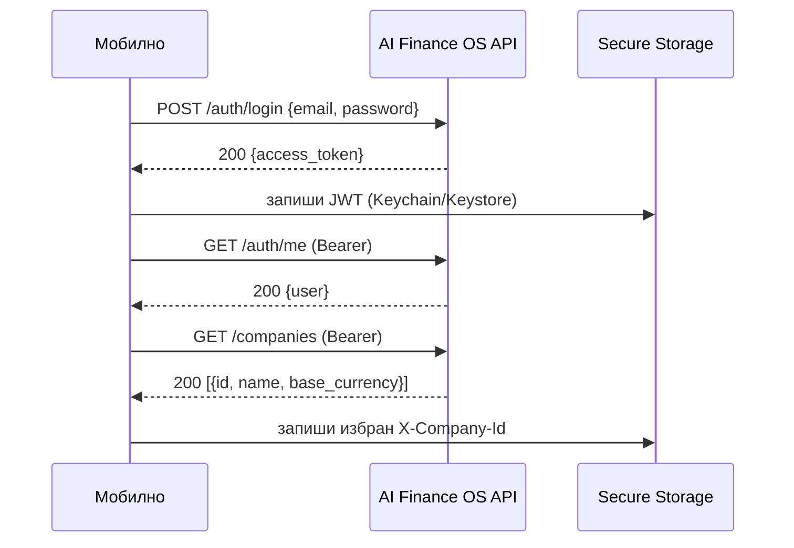
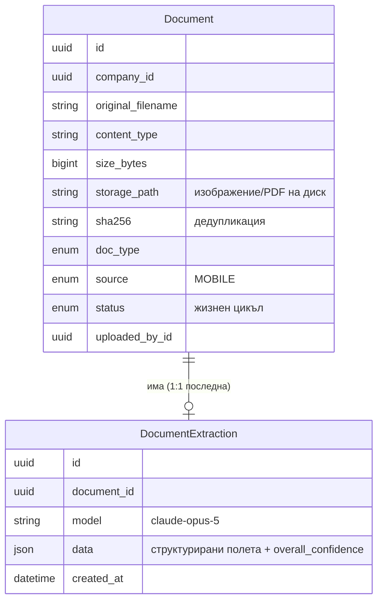
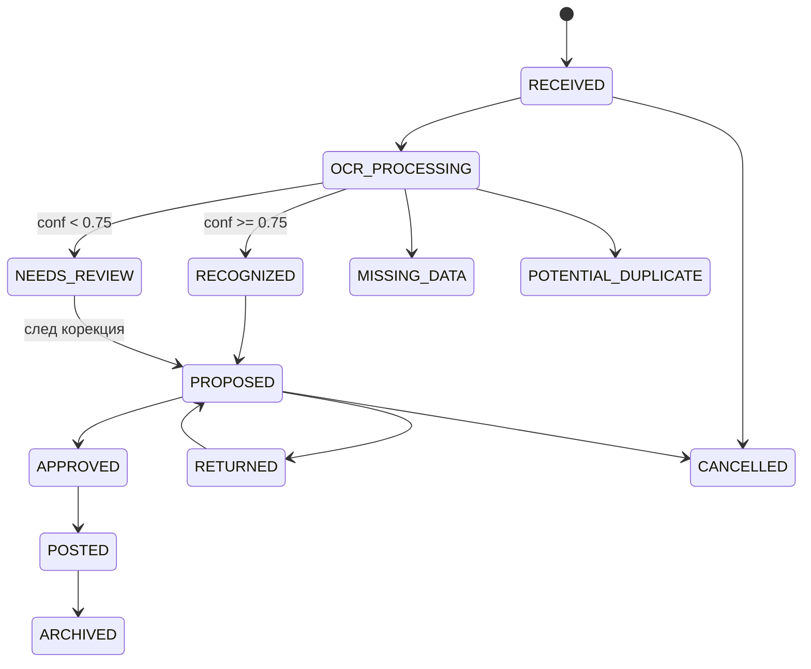
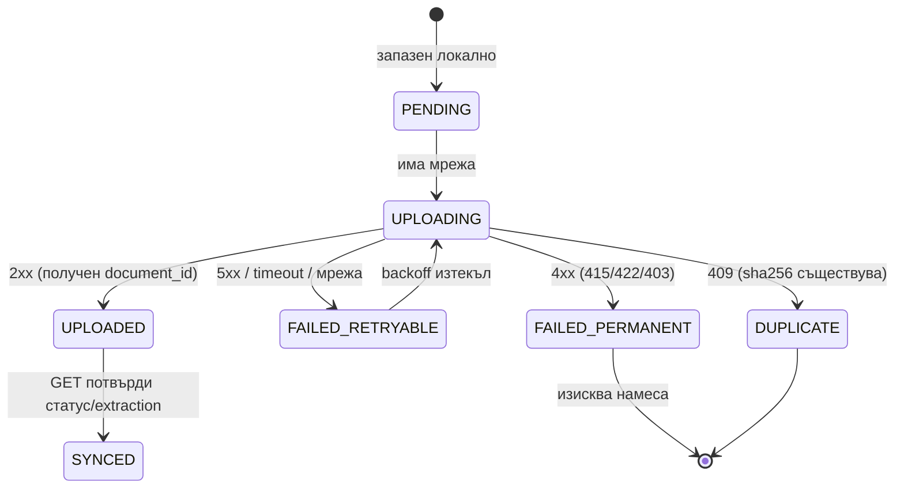
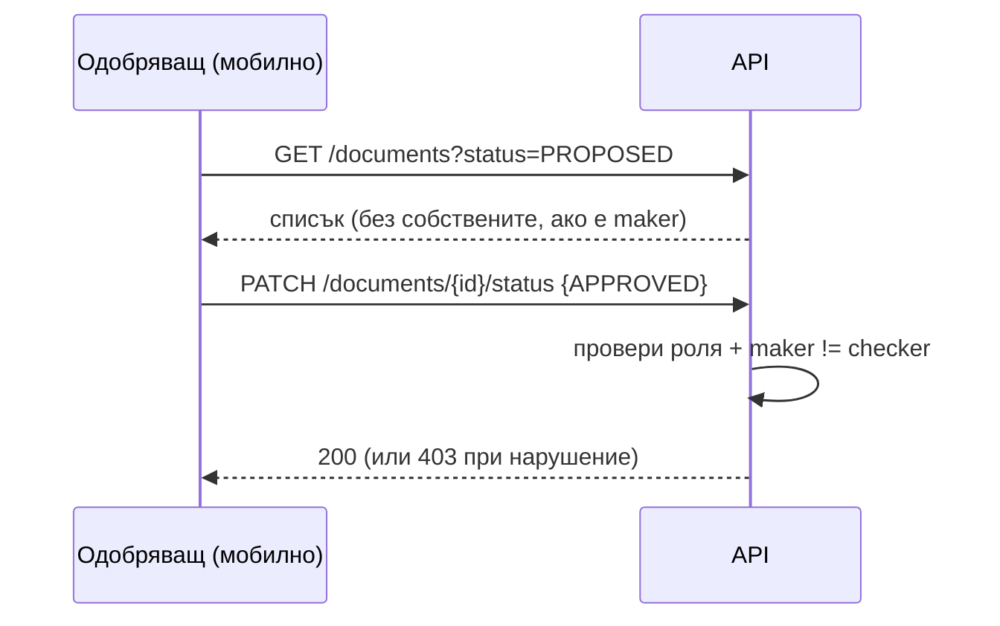

# Мобилно приложение AI Finance OS — Архитектурен документ

> Версия: 1.0 · Език: български · Аудитория: мобилни и backend разработчици
> Цел: разработчик да може да започне имплементацията директно по този документ.

---

## 1. Обзор и обхват

Мобилното приложение е **тънък, offline-first клиент** към съществуващата система **AI Finance OS** (AI-базирана финансова операционна система: счетоводство, ДДС, банки, фактури, плащания). Приложението **не съдържа бизнес логика за осчетоводяване** — то е канал за захранване на документния pipeline и за човешки одобрения.

### Основни сценарии (use-cases)

1. **Сканиране на фактура с телефона** → изпращане към сървъра → OCR чрез AI → запис едновременно като **изображение** (`storage_path`) и като **структурирани данни** (`DocumentExtraction.data`).
2. **Преглед на статуса** на документите през жизнения им цикъл.
3. **Мобилни одобрения** на документи и плащания (maker-checker).
4. **Нотификации** (push) за ключови събития: „документ разпознат", „нужна проверка", „чакащо одобрение".

### Ключови принципи

- **AI само предлага, не осчетоводява автоматично.** Човек винаги потвърждава.
- **Мобилното НЕ извършва реални плащания и трансфери.** То само **одобрява/отхвърля** предложения. Изпълнението остава на backend/уеб.
- **Offline-first.** Сканът се запазва локално и се качва при наличие на мрежа.
- **Мултитенант.** Всяка заявка носи `Authorization: Bearer <JWT>` + `X-Company-Id`.

---

## 2. Технологичен избор

### Реализиран стек: **Flutter (Dart)**

Проектът е избрал **Flutter** за единна кодова база за **iOS + Android**.

**Обосновка (накратко):**

- **Една кодова база** за двете платформи → по-малък екип, по-бърза итерация; важно за продукт с един първи клиент.
- **Native camera достъп** и зрял екосистем от пакети за **document scanning / edge detection** (`cunning_document_scanner`, `camera`).
- **Отлична offline поддръжка**: `drift`/`sqflite` за локална опашка, `workmanager` за фонов ъплоуд.
- **Compiled native UI** (Skia/Impeller) → плавен UX без WebView прослойки.
- **Silна поддръжка за secure storage, биометрия и push** (`flutter_secure_storage`, `local_auth`, `firebase_messaging`).

### Целеви версии и инструменти

| Компонент | Избор |
|---|---|
| SDK | Flutter stable (Dart 3.x, sound null-safety) |
| Минимален iOS | iOS 14+ |
| Минимален Android | API 24 (Android 7.0)+ |
| State management | **Riverpod** (виж §3.1) |
| Локална БД | **drift** (typed SQL върху SQLite) |
| HTTP | **dio** (interceptors, retry, cancel tokens) |
| DI | Riverpod providers |
| Кодогенерация | `freezed` + `json_serializable` |

---

## 3. Архитектурни слоеве

Приложението следва **чиста слоеста архитектура** (Clean Architecture, feature-first), с еднопосочна зависимост навътре: `presentation → domain ← data`, а `platform` захранва `data`.

```mermaid
flowchart TB
    subgraph Presentation["Presentation (UI)"]
        S[Screens / Widgets]
        VM[Riverpod Notifiers / Controllers]
    end
    subgraph Domain["Domain (чист Dart, без Flutter)"]
        E[Entities<br/>Scan, Document, Extraction, Approval]
        UC[Use-cases<br/>ScanInvoice, SyncQueue, ApproveDoc]
        RI[Repository Interfaces]
    end
    subgraph Data["Data"]
        RImpl[Repository Implementations]
        API[API Client (dio)]
        DB[(Local DB — drift/SQLite)]
        SEC[Secure Storage]
    end
    subgraph Platform["Platform"]
        CAM[Camera / Scanner]
        FS[File System]
        BG[WorkManager (background upload)]
        PUSH[FCM / APNs]
        BIO[Biometrics]
    end

    S --> VM --> UC
    UC --> RI
    RImpl -.implements.-> RI
    UC --> E
    RImpl --> API
    RImpl --> DB
    RImpl --> SEC
    CAM --> RImpl
    FS --> RImpl
    BG --> RImpl
    PUSH --> VM
    BIO --> VM
    API -->|HTTPS + Bearer + X-Company-Id| Backend[(AI Finance OS API)]
```

### 3.1 State management — препоръка: **Riverpod**

Избираме **Riverpod** (пред BLoC) за този проект, защото:

- По-малко boilerplate от BLoC при същата тестируемост.
- `AsyncNotifier` покрива естествено loading/data/error за екрани зависими от мрежа.
- Compile-safe DI без `BuildContext` (удобно за фонови задачи и repository слой).
- Лесно комбиниране на реактивни потоци (напр. `watch` върху локалната опашка от drift).

> BLoC остава валидна алтернатива, ако екипът вече е стандартизирал върху него. Архитектурата не зависи от избора — само presentation слоят се сменя.

### 3.2 Отговорности по слой

| Слой | Отговорност | Примерни артефакти |
|---|---|---|
| **presentation** | екрани, навигация, форматиране, показване на състояния | `ScannerScreen`, `DocumentDetailScreen`, `UploadQueueController` |
| **domain** | бизнес правила независими от Flutter/API | `ScanInvoice` use-case, `Document` entity, `DocumentStatus` enum |
| **data** | реализация на repository, mapping DTO↔entity, кеш | `DocumentsRepositoryImpl`, `ApiClient`, `AppDatabase` |
| **platform** | достъп до хардуер/OS | scanner plugin, secure storage, workmanager, push |

---

## 4. Сканиране на документи

### 4.1 Поток на сканиране

```mermaid
flowchart LR
    A[Бутон „Сканирай"] --> B[cunning_document_scanner]
    B --> C[Edge detection + auto-crop<br/>+ perspective correction]
    C --> D{Още страници?}
    D -->|Да| B
    D -->|Не| E[image: компресия JPEG<br/>ресайз до дълга страна ~2200px]
    E --> F{Много страници?}
    F -->|Да| G[pdf: сглоби многостраничен PDF]
    F -->|Не| H[Единичен JPEG]
    G --> I[Изчисли sha256 + запиши в опашка]
    H --> I
```

### 4.2 Пакети

| Задача | Пакет | Бележка |
|---|---|---|
| Document scanner (edge detection, auto-crop, multi-page) | **`cunning_document_scanner`** | обвива native VisionKit (iOS) / ML Kit Document Scanner (Android) |
| Директен достъп до камера (fallback / custom UI) | **`camera`** | когато трябва пълен контрол |
| Обработка на изображение (ресайз, компресия, JPEG) | **`image`** | pure-Dart, encode/decode/resize |
| Многостраничен PDF | **`pdf`** + **`printing`** | сглобяване на страници в един PDF |
| Импорт от галерия | **`image_picker`** | избор на съществуваща снимка/файл |
| Приемане на споделен файл (Share Sheet / Intent) | **`receive_sharing_intent`** | „Сподели към AI Finance OS" от друго приложение |
| Хеширане | **`crypto`** | `sha256` над байтовете преди качване |
| Пътища за временни файлове | **`path_provider`** | app documents / temp dir |

### 4.3 Правила за изображението

- **Компресия:** JPEG quality ~80; дълга страна ресайз до ~2200px (баланс OCR четимост ↔ размер).
- **Целеви размер:** < 5 MB на страница (виж §5.4 за 413).
- **Формат по подразбиране:** единична страница → **JPEG** (`image/jpeg`); много страници → **PDF** (`application/pdf`).
- **Импорт от галерия / споделяне:** същият post-processing pipeline (компресия + sha256), `source=MOBILE`.

### 4.4 Dart скица за сканиране

```dart
Future<ScanDraft> captureScan() async {
  final pages = await CunningDocumentScanner.getPictures() ?? [];
  if (pages.isEmpty) throw const ScanCancelled();

  final processed = <Uint8List>[];
  for (final path in pages) {
    final raw = await File(path).readAsBytes();
    final decoded = img.decodeImage(raw)!;
    final resized = img.copyResize(decoded, width: 2200); // запазва пропорции
    processed.add(Uint8List.fromList(img.encodeJpg(resized, quality: 80)));
  }

  final Uint8List bytes;
  final String contentType;
  final String filename;
  if (processed.length == 1) {
    bytes = processed.first;
    contentType = 'image/jpeg';
    filename = 'scan_${DateTime.now().millisecondsSinceEpoch}.jpg';
  } else {
    bytes = await buildPdf(processed); // pdf package
    contentType = 'application/pdf';
    filename = 'scan_${DateTime.now().millisecondsSinceEpoch}.pdf';
  }

  final digest = sha256.convert(bytes).toString();
  return ScanDraft(
    clientUuid: const Uuid().v4(),
    bytes: bytes,
    contentType: contentType,
    filename: filename,
    sha256: digest,
  );
}
```

---

## 5. API контракт

### 5.1 Base URL и общи хедъри

```
Base: https://api.<env>.ai-finance-os.example/api/v1
Хедъри (за защитени заявки):
  Authorization: Bearer <access_token>
  X-Company-Id: <uuid на избраната компания>
  Content-Type: multipart/form-data     (за upload)
```

### 5.2 Auth flow



**Login заявка/отговор:**

```http
POST /api/v1/auth/login
Content-Type: application/json

{ "email": "user@firm.bg", "password": "••••••••" }
```
```json
{ "access_token": "eyJhbGciOiJIUzI1NiIsInR5cCI6IkpXVCJ9..." }
```

**Refresh стратегия.** Backend към момента издава единствен `access_token` (JWT HS256, Bearer). Мобилната стратегия:

- Съхранявай JWT в secure storage; декодирай `exp` локално (без валидиране на подписа) за проактивна проверка.
- При `401 Unauthorized` от която и да е заявка → изчисти токена, спри фоновия ъплоуд, върни потребителя към **Login** (запази опашката — тя се качва след ре-логин).
- **Разширение (когато backend добави refresh):** при налична `POST /auth/refresh` — `dio` interceptor опреснява прозрачно при `401` и повтаря оригиналната заявка веднъж. Проектирай `AuthInterceptor` така, че добавянето да е локализирано.

### 5.3 Комбиниран scan endpoint (основен за мобилното)

> Планиран за добавяне в backend. Мобилното е първи консуматор.

```http
POST /api/v1/documents/scan
Authorization: Bearer <token>
X-Company-Id: 2f1c...e9
Content-Type: multipart/form-data

--boundary
Content-Disposition: form-data; name="file"; filename="scan_1737795012.jpg"
Content-Type: image/jpeg
<binary>
--boundary
Content-Disposition: form-data; name="note"

Фактура от доставчик X
--boundary--
```

**Успешен отговор `201 Created`:**

```json
{
  "document": {
    "id": "d3b07384-d9a0-4f2b-9a4c-1e2f3a4b5c6d",
    "company_id": "2f1c8e4a-7b3d-4c2a-9f1e-0a1b2c3d4e9f",
    "original_filename": "scan_1737795012.jpg",
    "content_type": "image/jpeg",
    "size_bytes": 842013,
    "sha256": "9f86d081884c7d659a2feaa0c55ad015a3bf4f1b2b0b822cd15d6c15b0f00a08",
    "doc_type": "INVOICE_PURCHASE",
    "source": "MOBILE",
    "status": "RECOGNIZED",
    "created_at": "2026-07-25T09:31:07Z"
  },
  "extraction": {
    "model": "claude-opus-5",
    "data": {
      "supplier_name": "Доставчик ЕООД",
      "supplier_vat": "BG123456789",
      "invoice_number": "0000004521",
      "invoice_date": "2026-07-20",
      "currency": "EUR",
      "net_amount": "1000.00",
      "vat_amount": "200.00",
      "total_amount": "1200.00",
      "vat_rate": "20",
      "line_items": [
        { "description": "Услуга X", "quantity": "1", "unit_price": "1000.00", "amount": "1000.00" }
      ],
      "overall_confidence": 0.92
    }
  }
}
```

**Ниска увереност → `status: "NEEDS_REVIEW"`** (при `overall_confidence < 0.75`). Клиентът показва данните като редактируем формуляр (§6.3).

### 5.4 Обработка на грешки

| HTTP | Значение | Поведение на клиента |
|---|---|---|
| `400` | невалидна заявка | покажи техническо съобщение, логни (без чувствителни данни) |
| `401` | изтекъл/невалиден JWT | изчисти токена → Login (виж §5.2) |
| `403` | липса на роля/членство за компанията | „Нямате права за тази компания" |
| `409` | дубликат по sha256 (ако backend го връща) | покажи съществуващия документ, не създавай нов |
| `413` | файлът е твърде голям | пре-компресирай (по-нисък quality / по-малка ширина) и опитай пак; ако пак > лимит → уведоми |
| `415` | неподдържан content-type | приемай само `image/jpeg`, `image/png`, `application/pdf` |
| `422` | валидационна грешка (Pydantic) | покажи полетата с грешки; за scan обикновено проблем с `file`/`source` |
| `429` | rate limit | backoff (виж §? retry) |
| `5xx` | сървърна грешка | оставяй в опашката, retry с backoff |

**Fallback без комбиниран endpoint.** Ако `/documents/scan` не е наличен, клиентът изпълнява двустъпков flow, който дава същия резултат:

1. `POST /api/v1/documents` (multipart: `file`, `source=MOBILE`) → `{id}`
2. `POST /api/v1/ai/documents/{id}/extract` → извличане + статус
3. `GET /api/v1/documents/{id}` за финалния статус.

Repository слоят капсулира избора (single-call vs. two-call) зад един метод `submitScan()`.

### 5.5 Останали използвани endpoints

| Метод | Път | Употреба в мобилното |
|---|---|---|
| `GET` | `/documents?status=&limit=&offset=` | списък документи, филтри по статус |
| `GET` | `/documents/{id}` | детайл + текущ статус |
| `GET` | `/documents/{id}/file` | сваляне/преглед на оригинала (auth, streaming) |
| `PATCH` | `/documents/{id}/status` | смяна на статус (одобри/върни) |
| `GET` | `/auth/me` | профил |
| `GET` | `/companies` | избор на компания |

---

## 6. OCR поток end-to-end

### 6.1 Sequence: от „Сканирай" до показани данни

```mermaid
sequenceDiagram
    autonumber
    participant U as Потребител
    participant App as Мобилно (UI)
    participant Q as Локална опашка (drift)
    participant Net as Upload worker
    participant API as API
    participant AI as AI/OCR (claude-opus-5)
    participant DB as Backend DB + Storage

    U->>App: Натиска „Сканирай"
    App->>App: Camera + edge detection + crop
    App->>App: Компресия, sha256, (PDF/JPEG)
    App->>Q: Запиши ScanItem (status=PENDING, thumbnail)
    App-->>U: „Добавено в опашката"
    Q->>Net: има мрежа + PENDING
    Net->>API: POST /documents/scan (multipart, Bearer, X-Company-Id)
    API->>DB: съхрани файл (storage_path), Document(source=MOBILE, RECEIVED→OCR_PROCESSING)
    API->>AI: extract(document)
    AI-->>API: DocumentExtraction.data + overall_confidence
    API->>DB: запиши extraction; статус RECOGNIZED (≥0.75) или NEEDS_REVIEW
    API-->>Net: 201 {document, extraction}
    Net->>Q: маркирай ScanItem UPLOADED, свържи server document_id
    Net->>App: notify
    App-->>U: Показва изображение + разпознати данни + статус
    alt overall_confidence < 0.75
        App-->>U: Формуляр за ръчна корекция (NEEDS_REVIEW)
        U->>API: PATCH /documents/{id}/status (или коригирани данни)
    end
```

### 6.2 Какво се пази къде

| Данни | Клиент (телефон) | Сървър |
|---|---|---|
| Оригинал (JPEG/PDF) | временно до успешен upload, после само **thumbnail** кеш | **`storage_path`** (диск, дедуп по sha256) |
| Структурирани данни | кеш за офлайн преглед (в drift) | **`DocumentExtraction.data`** |
| sha256 | изчислен клиентски (идемпотентност) | `Document.sha256` (дедупликация) |
| Статус | огледален кеш, ре-синхронизиран при `GET` | **`Document.status`** (източник на истината) |
| JWT / X-Company-Id | secure storage | — |

### 6.3 Ниска увереност и ръчна корекция

- При `NEEDS_REVIEW` детайл-екранът показва **редактируем формуляр** с полетата от `extraction.data`, всяко с индикатор за увереност.
- Потребителят коригира и потвърждава → `PATCH /documents/{id}/status` (напр. към `PROPOSED`) и/или изпращане на редактираните полета (когато backend изложи endpoint за update на extraction).
- Дотогава мобилното може да маркира документа като прегледан и да остави финалното осчетоводяване на уеб/backend — в съответствие с принципа „AI само предлага".

---

## 7. Съхранение: изображение + данни, свързани към един Document

Един **`Document`** е агрегатът, който държи заедно двете представяния:



- **Изображение** ↔ `Document.storage_path` (сървър). На клиента се пази само **thumbnail** кеш; пълният оригинал се тегли при нужда чрез `GET /documents/{id}/file`.
- **Данни** ↔ `DocumentExtraction.data` (JSON). Свързани към Document чрез `document_id`.
- **Връзка:** и двете сочат към един и същ `Document.id`. Клиентът локално държи `server_document_id`, за да мапне местния scan към сървърния запис.

### 7.1 Жизнен цикъл на статусите (сървър)

Реалният enum (`DocumentStatus`) включва:

```
RECEIVED → OCR_PROCESSING → RECOGNIZED
                          ↘ NEEDS_REVIEW
                          ↘ MISSING_DATA
                          ↘ POTENTIAL_DUPLICATE
RECOGNIZED / NEEDS_REVIEW → PROPOSED → APPROVED → POSTED → ARCHIVED
PROPOSED → RETURNED (за корекция)
(всеки) → CANCELLED
```



Мобилното участва основно до **PROPOSED / APPROVED / RETURNED**; `POSTED` (осчетоводяване) остава сървърна/уеб отговорност.

---

## 8. Offline-first и опашка за качване

### 8.1 Състояния на скан на клиента



### 8.2 Локална схема (drift)

```dart
class ScanItems extends Table {
  TextColumn get clientUuid => text()();            // идемпотентен ключ
  TextColumn get sha256 => text()();
  TextColumn get filePath => text()();              // локален файл до upload
  TextColumn get thumbnailPath => text().nullable()();
  TextColumn get contentType => text()();
  IntColumn  get sizeBytes => integer()();
  TextColumn get note => text().nullable()();
  TextColumn get status => text().withDefault(const Constant('PENDING'))();
  IntColumn  get attempts => integer().withDefault(const Constant(0))();
  DateTimeColumn get nextAttemptAt => dateTime().nullable()();
  TextColumn get serverDocumentId => text().nullable()();
  TextColumn get serverStatus => text().nullable()();
  TextColumn get extractionJson => text().nullable()(); // кеш на данните
  DateTimeColumn get createdAt => dateTime()();

  @override
  Set<Column> get primaryKey => {clientUuid};
}
```

### 8.3 Ъплоуд, retry, идемпотентност

- **Идемпотентност:** клиентският `clientUuid` + `sha256` предотвратяват дублирано създаване. Backend дедупликира по `sha256`; `409` се третира като „вече качено".
- **Retry с exponential backoff:** `delay = base * 2^attempts + jitter`, напр. `base=5s`, cap `~15min`. Само за `FAILED_RETRYABLE` (5xx/timeout/офлайн). `4xx` → `FAILED_PERMANENT`, без автоматичен retry.
- **Фонов ъплоуд:** `workmanager` регистрира периодична/constrained задача (`NetworkType.connected`), която обхожда `PENDING`/`FAILED_RETRYABLE` с изтекъл `nextAttemptAt`.
- **Детекция на мрежа:** `connectivity_plus` — при преход offline→online се тригва незабавен sync.
- **Изтриване на локален файл** едва след `UPLOADED` (запазва се само thumbnail).

```dart
Future<void> processQueueOnce() async {
  final items = await db.pendingScans(); // PENDING или due FAILED_RETRYABLE
  for (final item in items) {
    try {
      await db.setStatus(item.clientUuid, 'UPLOADING');
      final res = await api.submitScan(
        bytes: await File(item.filePath).readAsBytes(),
        filename: item.filename,
        contentType: item.contentType,
        note: item.note,
        idempotencyKey: item.clientUuid,
      );
      await db.markUploaded(item.clientUuid, res.documentId, res.status, res.extractionJson);
      await _dropOriginalKeepThumbnail(item);
    } on ApiStatus(code: 409) {
      await db.setStatus(item.clientUuid, 'DUPLICATE');
    } on ApiStatus(code: >= 400 && < 500) {
      await db.setStatus(item.clientUuid, 'FAILED_PERMANENT');
    } catch (_) {
      await db.scheduleRetry(item.clientUuid, backoffFor(item.attempts));
    }
  }
}
```

---

## 9. Сигурност

- **JWT в secure storage:** `flutter_secure_storage` → iOS **Keychain**, Android **Keystore/EncryptedSharedPreferences**. Никога в `SharedPreferences`/plain files.
- **TLS + certificate pinning:** `dio` с `SecurityContext`/pinning на публичния ключ (SPKI hash). Fail-closed при несъответствие. Поддържай backup pin за ротация.
- **Без чувствителни данни в логове:** interceptor маскира `Authorization`, тела на фактури, суми, VAT номера. Прод билд без verbose logging; crash reporting без PII.
- **Биометрично отключване:** `local_auth` (Face ID / Touch ID / Android Biometric) при отваряне и след таймаут на бездействие. JWT достъпен само след успешна биометрия.
- **Изтичане на сесия:** локален таймер по `exp`; при изтичане/бездействие → заключване, изискване на биометрия/ре-логин. `401` → пълен logout.
- **Минимални права:** искай **само камера** (при сканиране) и нотификации. Без контакти/локация/микрофон. Импорт от галерия през системния picker (без пълен gallery permission където е възможно).
- **Мобилното НЕ извършва плащания/трансфери** — само одобрения (§10). Няма код за иницииране на реални финансови операции.
- **GDPR аспекти:**
  - Фактурите съдържат лични данни (имена, ЕИК/ДДС, суми) → минимизирай локалното задържане (изтривай оригинала след upload, пази само thumbnail).
  - Данните са на сървъра (източник на истината); локалният кеш е изчистваем при logout.
  - Ясно право на изтриване: logout → wipe на локална БД, кеш и secure storage.
  - Data-in-transit (TLS) и data-at-rest (Keychain/Keystore + шифрован SQLite при нужда чрез `sqlcipher`).

---

## 10. Мобилни одобрения (maker-checker)

- Екран **Одобрения** показва списък с **чакащи документи** (`status=PROPOSED`) и **чакащи плащания** (payment approvals — през payments модула).
- Действия: **Одобри** / **Отхвърли (Върни)** → `PATCH /documents/{id}/status` (`APPROVED` / `RETURNED`) или съответния payment approval endpoint.
- **Maker-checker правило:** одобряващият **не може** да е същият потребител, който е подготвил/качил документа. Правилото се налага **на сървъра** (проверка `uploaded_by_id != current_user` и роля). UI също крие бутона „Одобри" за собствените записи, но сървърът е авторитетът.
- **Мобилното само сигнализира решение** — реалното изпълнение на плащане остава сървърна операция.



---

## 11. Нотификации (Push)

- **Транспорт:** **FCM** (Android + iOS чрез APNs bridge) през `firebase_messaging`; регистрация на device token към backend (нов endpoint `POST /devices`).
- **Типове събития:**
  | Събитие | Тригер | Deep link |
  |---|---|---|
  | „Документ разпознат" | статус → `RECOGNIZED` | Детайл на документ |
  | „Нужна проверка" | статус → `NEEDS_REVIEW` / `MISSING_DATA` | Формуляр за корекция |
  | „Чакащо одобрение" | статус → `PROPOSED` (за checker) | Екран Одобрения |
- **Данни в payload:** само идентификатори (`document_id`, `type`), **без** чувствителни финансови стойности.
- **Foreground:** in-app banner; **background/terminated:** системна нотификация → deep link при tap.
- Уважавай per-company scope: при tap задай коректния `X-Company-Id`.

---

## 12. Екрани

| # | Екран | Съдържание |
|---|---|---|
| 1 | **Login** | email/парола → JWT; биометрия при следващи влизания |
| 2 | **Избор на компания** | списък от `GET /companies`; задава `X-Company-Id` |
| 3 | **Начало / Дашборд** | брой чакащи документи/одобрения, бързи действия |
| 4 | **Скенер** | камера, edge detection, multi-page, преглед преди изпращане |
| 5 | **Опашка за качване** | PENDING/UPLOADING/FAILED items, ръчен retry, изтриване |
| 6 | **Списък документи** | филтри по статус/тип, търсене, thumbnail-и |
| 7 | **Детайл на документ** | изображение (viewer) + разпознати данни + статус + история |
| 8 | **Одобрения** | чакащи документи/плащания, Одобри/Върни (maker-checker) |
| 9 | **Настройки** | компания, биометрия, изчистване на кеш, изход, версия |

---

## 13. Структура на проекта (Flutter)

Кодът живее в **`apps/mobile/`** (успоредно на `apps/api/`), запазвайки monorepo подхода.

```
apps/mobile/
├── android/
├── ios/
├── pubspec.yaml
├── analysis_options.yaml
└── lib/
    ├── main.dart
    ├── app.dart                      # MaterialApp, router, theme
    ├── core/
    │   ├── config/                   # env, base URL, flavors
    │   ├── network/
    │   │   ├── api_client.dart       # dio + interceptors
    │   │   ├── auth_interceptor.dart
    │   │   └── error_mapper.dart     # HTTP → ApiStatus
    │   ├── security/
    │   │   ├── secure_store.dart     # JWT, X-Company-Id
    │   │   ├── cert_pinning.dart
    │   │   └── biometrics.dart
    │   ├── storage/
    │   │   ├── app_database.dart      # drift
    │   │   └── scan_items_dao.dart
    │   └── utils/                     # hashing, image, pdf helpers
    ├── domain/
    │   ├── entities/                  # Document, Extraction, ScanItem, Approval (freezed)
    │   ├── repositories/              # интерфейси
    │   └── usecases/                  # ScanInvoice, SyncQueue, ApproveDocument
    ├── data/
    │   ├── dtos/                      # *_dto.dart + json_serializable
    │   ├── mappers/
    │   └── repositories_impl/
    ├── features/
    │   ├── auth/          (login, company_picker)
    │   ├── dashboard/
    │   ├── scanner/
    │   ├── upload_queue/
    │   ├── documents/     (list, detail)
    │   ├── approvals/
    │   └── settings/
    ├── background/
    │   ├── upload_worker.dart         # workmanager callback
    │   └── push_handler.dart          # firebase_messaging
    └── l10n/                          # bg + en локализация
```

### 13.1 Ключови зависимости (`pubspec.yaml`)

```yaml
dependencies:
  flutter_riverpod: ^2.5.0
  dio: ^5.5.0
  drift: ^2.18.0
  sqlite3_flutter_libs: ^0.5.0
  flutter_secure_storage: ^9.2.0
  local_auth: ^2.3.0
  cunning_document_scanner: ^1.2.0
  camera: ^0.11.0
  image: ^4.2.0
  image_picker: ^1.1.0
  pdf: ^3.11.0
  printing: ^5.13.0
  receive_sharing_intent: ^1.8.0
  crypto: ^3.0.5
  path_provider: ^2.1.0
  workmanager: ^0.5.2
  connectivity_plus: ^6.0.0
  firebase_messaging: ^15.0.0
  freezed_annotation: ^2.4.0
  json_annotation: ^4.9.0
  go_router: ^14.0.0
dev_dependencies:
  build_runner: ^2.4.0
  freezed: ^2.5.0
  json_serializable: ^6.8.0
  drift_dev: ^2.18.0
```

---

## 14. План за реализация по фази

### Фаза 0 — Основа (скелет)
- `apps/mobile/` scaffold, flavors (dev/staging/prod), CI билд.
- `dio` API client, `AuthInterceptor`, secure storage.
- Login + Избор на компания + `GET /auth/me`.

### Фаза 1 — MVP „Сканирай и качи"
- Скенер (edge detection, single/multi-page, компресия, sha256).
- Локална опашка (drift) + фонов ъплоуд (`workmanager`) + retry/backoff.
- Интеграция с `POST /documents/scan` (+ fallback two-call).
- Списък документи + Детайл (изображение + данни + статус).
- **Изход на MVP:** потребител сканира фактура офлайн/онлайн, тя се качва, OCR-ва и се вижда със статус.

### Фаза 2 — Проверка и одобрения
- Формуляр за корекция при `NEEDS_REVIEW`.
- Екран Одобрения (maker-checker) + `PATCH /status`.
- Push нотификации (FCM) за трите събития.

### Фаза 3 — Заздравяване
- Биометрично отключване, certificate pinning, session timeout.
- Дашборд с метрики, търсене/филтри.
- GDPR wipe при logout, шифрован локален кеш (`sqlcipher`).
- Локализация bg/en, accessibility, полиране на UX.

### Backend зависимости, които мобилното изисква
- `POST /api/v1/documents/scan` (комбиниран single-call).
- (Опционално) `POST /api/v1/auth/refresh` за refresh стратегия.
- `POST /api/v1/devices` за регистрация на push token.
- (Опционално) endpoint за update на `DocumentExtraction.data` след ръчна корекция.
- Payment approval endpoints за екран Одобрения.

---

## 15. Обобщение

Мобилното приложение е Flutter offline-first клиент, чиято водеща функция е сканиране на фактури (edge detection, multi-page, компресия), локална опашка с идемпотентен фонов ъплоуд и интеграция с комбинирания `POST /api/v1/documents/scan`, който в един кръг съхранява и изображението (`storage_path`), и структурираните данни (`DocumentExtraction.data`), свързани към един `Document`. Архитектурата е слоеста (presentation/domain/data/platform) с Riverpod, поддържа мултитенант auth (Bearer + `X-Company-Id`), човешки одобрения по maker-checker, push нотификации и стриктна сигурност (secure storage, cert pinning, биометрия, GDPR), без да извършва реални плащания.
